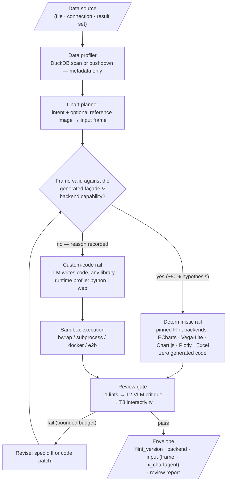
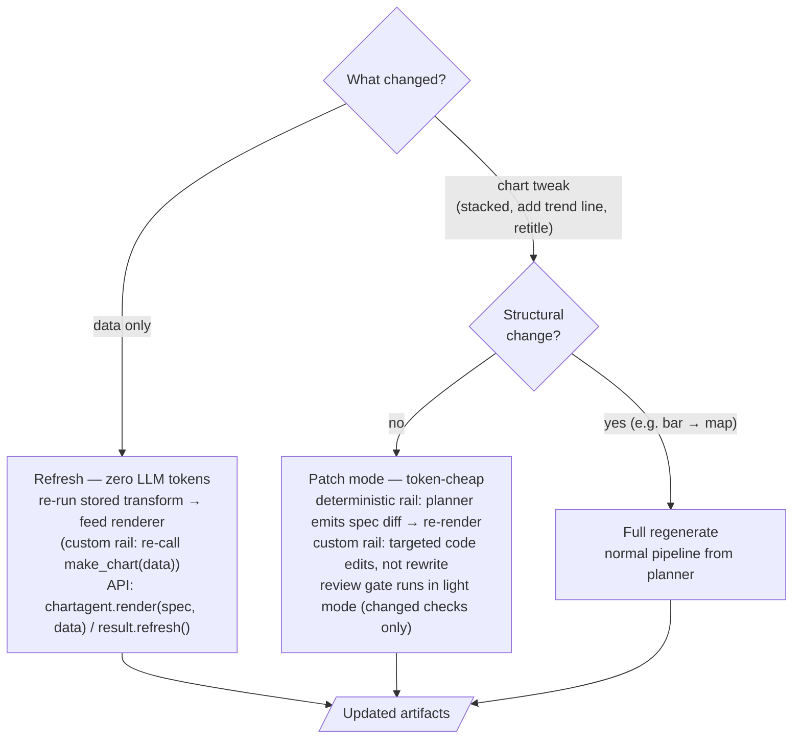

# chartagent — Product Requirements Document


|             |                                                                                               |
| ----------- | --------------------------------------------------------------------------------------------- |
| **Status**  | Draft v0.4 — demoted to a product document; architecture is owned by `docs/adr/`               |
| **Author**  | Sharim Pervez, with Claude                                                                    |
| **Date**    | July 9, 2026; demoted to product-only August 22, 2026                                         |
| **Product** | `chartagent` — an embeddable, agentic chart-creation library for Python, plus a hosted product built on it |
| **License** | Apache-2.0 (decided — patent grant, enterprise-friendly, matches ECharts/LangChain ecosystem) |


**Changelog v0.4:** demoted to a product-only document — §7.3 and §8 superseded by ADR-0001/0002 and reduced to pointers; non-goals 1 and 2 amended for the hosted product; P0.4's Matplotlib adapter withdrawn (Flint has no Matplotlib backend) and the third-party adapter protocol moved to P2; §11 phases redrawn to the four on the wayfinding map; renamed `chartagents` → `chartagent` throughout (file renamed to `chartagent-prd.md`); §13 records the naming and two-repo/open-core decisions.

**Changelog v0.3:** review hardening — determinism claim rescoped to spec-anchored reproducibility; ~80% deterministic-rail share explicitly marked a hypothesis with a validation gate *(the gate is at **P1 exit**, not Phase 0 — corrected by ADR-0013; the share cannot be scored before the planner exists)*; benchmark enlarged to ≥150 cases with an independent judge and human calibration (LLM-as-judge self-preference bias addressed); prompt injection via profiled metadata added as a first-class risk with mitigations; `raw_sql` escape scoped to file-like sources in v1; VFS persistence requirement for stateless refinement specified; schema-drift behavior on zero-LLM refresh specified; provisional cost-per-chart target published; observability hooks added to P1; team-size assumption stated.

**Changelog v0.2:** all v0.1 open questions resolved (§13); tiered local sandbox (bwrap auto-detect); three-flavor `DataSource` abstraction incl. text-to-SQL integration (Cortex Analyst pattern); zero-LLM refresh API promoted to P0; patch-mode chart edits; two-filesystem model documented; screenshot-reference scoped as P2; diagrams converted to Mermaid.

---


## 0. Status of this document

**This is a product document.** Its requirements, positioning, personas, user stories, goals, non-goals, success metrics and risks are authoritative and are what tickets cite as acceptance criteria. **Its architecture is not.** Architecture is owned by the ADRs in `docs/adr/`, which post-date this document and override it wherever the two disagree:

- **[ADR-0001 — Pin Flint; compile in the client](docs/adr/0001-embed-pinned-flint-compiler.md).** We pin one Flint release per library release and return an **envelope** — `{ flint_version, backend, input }`. Compilation happens in the caller's client, not in CPython; there is no JavaScript engine in the Python process, no Node sidecar in the library runtime, no port, and no fork.
- **[ADR-0002 — Adopt Flint's input frame as the chart spec](docs/adr/0002-adopt-flint-input-frame.md).** Flint's assembler argument *is* our chart spec. Our own grammar lives in exactly one namespaced sibling key, `x_chartagent`, and a Pydantic façade generated from the pinned bundle types it.
- **[ADR-0008 — The transform menu, and the three locks on its escape hatch](docs/adr/0008-the-transform-menu-and-its-escape-hatch.md).** `x_chartagent.transform` is eight fixed slots in one canonical order over a closed expression AST, compiled to DuckDB's relational API; `raw_sql` is an exclusive-or alternative held by three independent locks. Supersedes §8's op list, its compile-to-SQL claim, and its "file-like sources only" scope.

**Reading the older sections.** This document predates both ADRs, and its vocabulary has moved. Where the text below says:

| PRD v0.3 term | Read as | Owner |
| --- | --- | --- |
| ChartSpec v1 (the grammar) | the **input frame** plus `x_chartagent` | ADR-0002 |
| the saved ChartSpec (the stored artifact) | the stored **input frame**, without `data` | ADR-0002 Decision 3 |
| renderer adapter / `RendererAdapter` | a **Flint backend** (Vega-Lite, ECharts, Chart.js, Plotly, Excel) | ADR-0001 |
| `CapabilityProfile` | Flint's own per-backend capability metadata | ADR-0002 Decision 7 |
| the returned artifact | the **envelope**; rasterisation is a separate job | ADR-0001 Decision 5 |

`CONTEXT.md` is the canonical glossary and wins over any wording here.

**What did not change.** Every §13 decision except the naming check still stands. The two-rail structure, the metadata-not-data principle, the sandbox tiers, the review gate, the zero-LLM refresh guarantee and the whole requirements set survive the ADRs intact — what changed is *who compiles the spec and what grammar it is written in*, not what the product promises.

---


## 1. Problem statement

Every application team that wants "chart this data" as a product feature today faces the same build-vs-buy dead end. Building it means wiring together an LLM, a data-profiling layer, a code sandbox, a rendering pipeline, and a quality-review loop — months of infrastructure work that has nothing to do with their product. Buying it doesn't exist: consumer AI assistants (Claude, ChatGPT) produce excellent charts, but only inside their own chat UIs, on uploaded data, with no programmatic contract an application can depend on.

The cost of not solving this: thousands of SaaS products, internal tools, and data platforms either skip natural-language charting entirely, ship fragile home-grown LLM chart generators with no quality guarantees, or force users to leave the product and paste data into a chat assistant — losing the workflow, the branding, and control of the data.

chartagent closes this gap: a pip-installable library where `create_chart_agent()` + one method call turns a natural-language instruction and a pointer to data (file, S3 path, database connection, or an in-memory result set) into production-grade chart artifacts — with the data never leaving the caller's infrastructure.

---


## 2. Positioning and USP

**One-liner:** *Claude gives a person a chart in a chat. chartagent gives your application a charting capability behind an API.*

### The six pillars

1. **Embeddable, not conversational-only.** Output is a programmatic contract — typed artifacts (ECharts JSON, Plotly figure, PNG/SVG, HTML, and the validated ChartSpec itself) that drop directly into the caller's frontend, PDF export, or report pipeline. Not an artifact trapped in a chat session.
2. **Data never leaves your infrastructure.** Profiling runs via DuckDB against data where it lives (local files, S3/Parquet) or pushes down to the source engine (warehouse connections). Only metadata — schema, statistics, small samples — ever reaches the LLM. The execution sandbox is pluggable and self-hostable.
3. **Engineered reliability.** A deterministic rail (validated spec → hand-written renderer, zero generated code) handles the common majority of requests (working hypothesis: ~80%; validated in Phase 0, see §11); an agentic custom-code rail handles the rest; every chart passes a lint + VLM-critique + interactivity review gate before delivery. Reproducible by contract: every chart is anchored to its saved ChartSpec, and spec → artifact rendering is bit-stable across runs. (Planning is an LLM call and, like any model call, can vary between invocations — the spec, not the prompt, is the reproducibility anchor.) Published eval benchmark backs the quality claim.
4. **Cost and latency as a dial.** `quality="fast" | "balanced" | "best"` controls the review-loop budget per request; conversational edits are token-cheap patches, not full rewrites. (Refresh at *zero* cost is prominent enough to stand as its own pillar — see pillar 6.)
5. **Model-agnostic and customizable.** Any model via LangChain (including self-hosted for regulated environments). Org chart conventions — brand palettes, annotation rules, house style — ship as skills that apply to every generated chart.
6. **Generate once, refresh forever — at zero LLM cost.** A chart is a *saved spec*, not a one-off image. Re-rendering it against fresh data is a pure replay of the stored transform (deterministic rail: re-run the query → renderer; custom rail: re-call `make_chart(data)`) — no model call, no re-planning — so a scheduled dashboard of *any* size refreshes on a cron at **$0 inference cost** and sub-second latency (§7.7, P0.11). A drifted schema fails loud with a typed `SchemaDriftError` rather than drawing a silently-wrong chart. This is a durability guarantee a chat assistant cannot structurally offer — it falls directly out of the ChartSpec contract (pillar 3).


### "But Claude already does this"

Yes — for an individual, in a chat, with an uploaded file. chartagent is for the thousand applications that want to give that experience to *their own users*, on *their own data*, with an SLA-shaped contract instead of a conversation. The Claude app validates the demand; chartagent distributes the capability. (Stripe : "banks already move money" :: chartagent : "Claude already makes charts.")

### Adjacent-competitor note: text-to-SQL platforms

Text-to-SQL systems (e.g., Snowflake Cortex Analyst) answer "*what data*"; chartagent answers "*what chart*." They are complements, not competitors — Cortex Analyst returns generated SQL whose execution yields a small result set, and Snowflake's own agent stack merely returns a bare Vega-Lite spec for charting: no review loop, no custom rail, no quality gate. chartagent is the quality-assured visualization layer downstream of any text-to-SQL system (see §7.4, DataSource flavor 3).

---


## 3. Target users and personas


| Persona                                                    | Description                                                                                                                   | What they need                                                                                                                           |
| ---------------------------------------------------------- | ----------------------------------------------------------------------------------------------------------------------------- | ---------------------------------------------------------------------------------------------------------------------------------------- |
| **P1 — SaaS product engineer** (primary)                   | Adding a "describe the chart you want" feature to a customer-facing product                                                   | Simple API, structured JSON output for their web frontend, predictable cost/latency, consistent results, brand theming, zero-LLM refresh |
| **P2 — Data platform / internal-tools engineer** (primary) | Exposing self-serve visualization over a warehouse or lakehouse to non-technical colleagues                                   | Connection-based data access (no uploads), large-data handling, self-hostable sandbox, auditability                                      |
| **P3 — AI application developer** (secondary)              | Building a larger agentic app (report generator, analyst copilot, text-to-SQL frontend) that needs charting as one capability | Composability with LangChain/LangGraph, in-memory result-set input, streaming events, conversation-history pass-through                  |


Explicitly **not** a target: the individual analyst doing ad-hoc exploration in a chat — the Claude app already serves them well (see Non-goals).

---


## 4. User stories

**P1 — SaaS product engineer**

- As a SaaS engineer, I want to call `agent.create_chart(data, instruction)` and receive ECharts JSON, so that I can render the chart in my existing web frontend with one `<div>`.
- As a SaaS engineer, I want to re-render a saved ChartSpec against fresh data with a single no-LLM call, so that my dashboards refresh on schedule at zero inference cost.
- As a SaaS engineer, I want a `quality` knob per request, so that I can serve free-tier users cheaply and premium users with the full review loop.
- As a SaaS engineer, I want to register my brand palette and style rules once, so that every chart my users generate is on-brand without per-request prompting.
- As a SaaS engineer, I want to persist a chart's spec and re-render it identically at any time, so that my product behaves predictably even as models and prompts evolve.

**P2 — Data platform engineer**

- As a platform engineer, I want to point the agent at a 50 GB Parquet dataset on S3 or a warehouse connection, so that charts are produced without the data being uploaded anywhere or loaded fully into memory.
- As a platform engineer, I want aggregation pushed down to my warehouse for connection sources, so that compute happens where the data and governance already live.
- As a platform engineer, I want to run the code sandbox on my own infrastructure, and get real isolation on Linux without a Docker dependency, so that generated code never executes outside my security boundary.
- As a platform engineer, I want a structured review report with every chart, so that I can log why a chart was approved and what the loop fixed.

**P3 — AI application developer**

- As an AI app developer, I want to hand chartagent the result set my text-to-SQL system (e.g., Cortex Analyst) already produced, so that I get a reviewed, production-grade chart instead of a bare spec.
- As an AI app developer, I want to pass prior `result.messages` back into the next call, so that my users can refine charts conversationally ("now break that down quarterly") while my service stays stateless.
- As an AI app developer, I want edits to existing charts to be token-cheap patches rather than full regenerations, so that refinement loops are fast and affordable.
- As an AI app developer, I want streaming progress events (profiling → planning → rendering → reviewing), so that I can show live status in my UI.

**Edge cases**

- As any caller, when the data source is unreadable or the instruction is unanswerable from the schema, I want a structured, typed error (not a hallucinated chart), so that my app can handle it gracefully.
- As any caller, when the review loop exhausts its budget without passing, I want the best-so-far chart returned with `review.passed = False` and the failing checks listed, so that I can decide whether to show it.

---


## 5. Goals

1. **Time-to-first-chart under 15 minutes** from `pip install chartagent` to a rendered chart from a natural-language instruction (measured via docs quickstart user testing).
2. **≥ 95% executable-output rate and ≥ 85% rubric pass rate** on the public eval benchmark (≥ 150 cases, see P0.10) at `quality="balanced"`, scored by an **independent judge** — a model distinct from both the planner and the in-loop critique VLM, calibrated against human double-scoring each release (LLM judges measurably favor their own generations; see §14). At n = 150, the 95% confidence interval on a 95% rate is roughly ±3.5 pp — narrow enough to publish; at n = 30 it would be ±8 pp, which is not. (LIDA's ~3.5% visualization error rate is directional prior art only — its metric and task definition differ, so we cite it as context, not as a head-to-head comparison.)
3. **≥ 75% of benchmark requests served by the deterministic rail** — a **target reported with a confidence interval, not a pass/fail criterion**: separating 75% from the ~80% hypothesis it tests needs n ≈ 440 at 80% power, and the benchmark is ≥150 cases, so it cannot be evaluated as a gate at any planned n (the gate is §11's <60%, affordable because 60-vs-80 needs only n ≈ 33). Goal 2 above already applies this discipline; **ADR-0013** applies it here —, keeping **median cost per chart ≤ $0.05 at** `balanced` (provisional target assuming a Sonnet-class planner and small critique model; finalized from measured token counts in Phase 2 and published with the benchmark); **refresh of an existing chart costs zero LLM tokens**.
4. **Handle a 10 GB Parquet source with < 500 MB peak agent-process memory** — proof of the profile-don't-load architecture.
5. **Adoption:** 1,000 GitHub stars / 10k monthly PyPI downloads within 6 months of v1.0 (proxy for "the default chart agent" positioning).

---


## 6. Non-goals

1. **The library ships no UI.** `chartagent` is a library and (later) a reference server; it has no interface of its own and never becomes one. A **hosted product is a separate offering built on the library**, living in its own repository and consuming the library's public API only — it may ultimately become a commercial layer (§13, open core). Rationale unchanged: the positioning discipline of §2 still holds — neither the library nor the hosted product competes with Claude/ChatGPT's chat UI. What is ruled out is the *library* growing a UI, not the existence of a product that has one. *(Amended v0.4: v0.3 read "never a hosted consumer product," which contradicted the planned hosted product.)*
2. **The library is not a BI platform.** No dashboard persistence, sharing, permissions, or scheduled reports in the *library* in v1 — it stays stateless, and its output composes into BI tools instead. The hosted product does save charts and refresh them on a schedule (`design/` already mocks this up), which is precisely the zero-LLM refresh guarantee of pillar 6 exercised by a first-party caller. That is a product feature built *on* the public API, not a library feature. Multi-tenancy, sharing and permissions remain out of scope for both until at least P1. *(Amended v0.4.)*
3. **Not a general data-analysis agent.** No open-ended EDA, statistical modeling, or "find insights" in v1. The instruction in, chart out contract stays tight. Rationale: quality claims are only defensible on a bounded task. (P2 future consideration.)
4. **Not multi-chart dashboards in v1.** One instruction → one best chart. Rationale: dashboard layout is a distinct hard problem; single-chart quality is the wedge.
5. **Not a training/fine-tuning effort.** We engineer around frontier models via prompting, skills, and review loops. Rationale: model-agnosticism is a pillar; fine-tunes break it.
6. **Not chart-data extraction from images.** When a screenshot is supplied as a reference (P2 feature, §9), we extract *style and structure only* — never the numeric values, which is an error-prone OCR problem that would poison our data-truthfulness guarantees.

---


## 7. Architecture overview


### 7.1 Core principle

**The LLM never touches raw data — only metadata flows through the agent; data flows only through the sandbox (or the source's own engine).**

> **Erratum — 2026-08-28 ([#6](https://github.com/thearcscode/chartagent/issues/6), [ADR-0015](docs/adr/0015-the-sandbox-runs-programs-we-did-not-write.md)).** The second clause is **inverted**. Data flows through `bind`, **in-process** — ADR-0005 Decision 6 and ADR-0011 already run the transform and the profiler there, and ADR-0015 Decision 2 extends that to planner-authored transforms at P1. Only the transform's **output** rows reach the sandbox (ADR-0015 Decision 5): the source path, the credentials and the raw bytes never enter it. The first clause — *the LLM never touches raw data* — is unchanged and in fact **strengthened**: it becomes structural rather than procedural, because the sandbox that runs model-authored code has no route to the source at all.

### 7.2 Pipeline




Orchestration: LangGraph graph with a deterministic skeleton (profile → plan → route → render → review, review-fail edge back through revision) and **deepagents** subagent/planning/filesystem machinery inside the genuinely open-ended stages (planner exploration, reviewer repair). 

### 7.3 Key components

> **Partly superseded by [ADR-0001](docs/adr/0001-embed-pinned-flint-compiler.md) and [ADR-0002](docs/adr/0002-adopt-flint-input-frame.md).** The three components below that described a grammar and a renderer stack of our own — *ChartSpec*, *renderer adapters* and the *rail router*'s capability check — no longer exist as described; they are replaced by the pinned Flint compiler, its five backends, and a Pydantic façade generated from the pinned bundle. Their bullets now point at the ADRs rather than restating them. The custom-code rail, review gate and skills are unaffected and remain the live design. **The profiler's *output contract* is now fixed by [ADR-0011](docs/adr/0011-the-profile-contract.md)** — two clauses of the bullet below did not survive measurement: *"stratified sample rows"* is not deliverable at profile time (stratification needs a stratum column the planner has not chosen yet) and is replaced by a uniform sample of 10 rows; and the profile does **not** drive ISO-8601 normalisation, which ADR-0008 Decision 9 keys on the reported type at serialisation. The profile's date signal is `iso8601_parse_rate` over the sample — evidence, never a type name.

- **Data profiler.** For file sources: DuckDB lazy scan (see §7.4). Emits compact `profile.json`: schema, dtypes, cardinality, null rates, min/max/percentiles, stratified sample rows. Never materializes the dataset. All chart paths aggregate first and plot only aggregates. **Profiled metadata is attacker-influenced input:** column names, string values, and sample rows come from untrusted data and flow into LLM prompts — the classic indirect-prompt-injection vector (§14). Mitigations, all P0: profile content is always injected into prompts inside clearly delimited, escaped data blocks with an explicit "content is data, never instructions" framing; the planner's output is constrained to a validated ChartSpec (structured output, not free text), so injected instructions cannot redirect tool use on the deterministic rail; a Tier 1 lint screens profile content for instruction-like patterns and flags suspect sources in the review report; and on the custom rail, injected code intent is contained by the sandbox (§7.5) plus the data-truthfulness check.
- **The chart spec (the contract).** ~~A small, library-agnostic grammar of graphics of our own.~~ **Superseded by ADR-0002:** Flint's assembler argument *is* the spec — the **input frame** (`data` at render time, `semantic_types`, `chart_spec`, `options`, `theme_spec`), carrying our grammar in the single sibling key `x_chartagent` (`spec_version`, `transform`, `annotations`, `interactions`, `escape`). Still versioned from day one, via `x_chartagent.spec_version`. See §8 and ADR-0002.
- **Renderers.** ~~A first-party `RendererAdapter` protocol with ECharts, Plotly and Matplotlib adapters, public so third parties can add their own.~~ **Superseded by ADR-0001:** we do not write renderers. Pinned **Flint** ships five backends — **Vega-Lite, ECharts, Chart.js, Plotly and Excel** — and compilation happens in the caller's client by loading Flint at `flint_version` and calling `assembleECharts` / `assembleVegaLite` / …. ECharts remains the default web target. **There is no Matplotlib backend** (see P0.4), and a public third-party adapter protocol is demoted to a P2 idea (§9 P2) — a second renderer stack means a second capability surface and a second fidelity suite, which is the exact cost ADR-0001 paid to avoid. What survives unchanged: **rendering receives materialized aggregate rows** (small by construction), not query handles; live-query handles stay a P2 idea.
- **Rail router.** Deterministic validator checks the planner's frame against the chosen **Flint backend's** capability surface — Flint's own per-backend metadata, read off the pinned bundle, not a `CapabilityProfile` of ours (ADR-0002 Decision 7; note the vocabulary is per-backend, not flat). Expressible → deterministic rail. Not expressible → custom rail, with the *reason recorded* (telemetry that drives grammar growth: today's custom-rail requests become next version's deterministic ones). **The ~80% deterministic-rail share used throughout this document is a hypothesis, not a measurement** — it is derived from the concentration of common chart types in published request corpora, and is explicitly validated (or revised) against the pressure-test set and the eval benchmark (§11). **Superseded in part by [ADR-0013](docs/adr/0013-rail-share-is-pooled-and-pre-registered.md):** there is no Phase-0 number to have — the share is façade validity plus declared capability *on what the system served*, which needs a planner, and the planner is P1. The corpus is **authored** in Phase 0 (#7) and **scored** at P1 exit. ADR-0013 also fixes what "expressible" now means (façade-valid **and** within declared capability, against the union of backends — ADR-0012), that `raw_sql` charts count **in** the numerator while `raw_sql_used` is published separately, and that realised-capability failures are a **delivery rate**, not a rail-share miss.
- **Custom-code rail.** The agent may choose any charting library, constrained by available **sandbox runtime profiles**: `python` (matplotlib/plotly/bokeh/seaborn/…) and `web` (Node + headless Chromium for D3/ECharts-custom/Chart.js — required to rasterize for review). Codegen prompt biases toward well-represented libraries (benchmark evidence: error rates track training-data familiarity — e.g., 1.8% incorrect code for Matplotlib vs 22% for Plotly in PandasPlotBench) unless the request pulls elsewhere. Generated code must be shaped `def make_chart(data) -> Figure` — data enters as a parameter, never inlined — which is what makes zero-LLM refresh possible (§7.7).

> **Erratum — 2026-08-28 ([#55](https://github.com/thearcscode/chartagent/issues/55), [ADR-0016](docs/adr/0016-the-custom-rail-is-matplotlib-and-the-runner-owns-the-environment.md)).** Three corrections to this bullet. **"The agent may choose any charting library" is closed at phase P2**: `make_chart` must return a `matplotlib.figure.Figure`, which admits matplotlib and **seaborn** and excludes plotly and bokeh until a runner widening — closed on the *return type*, not an import list. The bias was never soft: the runner serialises matplotlib only (ADR-0015 D10 as amended), and P0.10's ≥ 95% executable-output rate is measured on this rail, so the 1.8%-vs-22% figure cited above is the reason to close it rather than to lean on it. **The prompt states the constraint** rather than letting the review loop rediscover it. And the `web` runtime profile named here is a **§9 P1 requirement in Fast follows**; phase P2 ships the python profile only (ADR-0015 D7).
- **Review gate (uniform across rails — everything ends as a rendered image + optional live DOM).**
  - *Tier 1, deterministic lints (cheap, always):* code executed; artifact exists; axis labels present; legend when >1 series; label-overlap detection; colorblind-safe palette; bar-chart y-axis baseline; **data-truthfulness check** (re-run the transform independently, compare against values in the figure object); injection-pattern screen on profiled metadata (instruction-like strings in column names/sample values flagged in the review report).
  - *Tier 2, VLM critique (only if lints pass):* rubric — readability, truthfulness to data, chart-type appropriateness, aesthetics; approve or emit structured feedback. Bounded loop (budget set by `quality`), best-of-so-far selection. (Prior art: METAL's generate→critique→revise loop shows monotonic quality gains with compute.)
  - *Tier 3, interactivity verification (HTML outputs):* Playwright loads the artifact; asserts no console errors, plot painted, hover produces tooltip; screenshots for the VLM.
- **Skills.** deepagents-style SKILL.md bundles for chart-domain knowledge (time-series conventions, per-library gotchas) and **user-extensible org conventions** (brand palette, "always annotate fiscal-year boundaries").

> **Erratum — 2026-08-28 ([#55](https://github.com/thearcscode/chartagent/issues/55), [ADR-0016](docs/adr/0016-the-custom-rail-is-matplotlib-and-the-runner-owns-the-environment.md)).** **No skills ship at phase P2** — the benchmark measures the fixed prompt, and a skills layer in the same phase would make the executable-output rate measure prompt-plus-skills with nothing attributable. Skills are the designed widening path, measured as a delta. **"Brand palette" must not be one of them:** ADR-0016 D5 puts the house palette on the runner via `rcParams`, so a palette-carrying skill would be a second route that either silently loses to `rcParams` or silently beats it. Fiscal-year annotations remain a good later skill.


### 7.4 DataSource abstraction — three flavors (decided)


| Flavor                   | Examples                                                                                                                                                                                                       | Engine                                                                                                                                                                                                                         | Profiling cost                  |
| ------------------------ | -------------------------------------------------------------------------------------------------------------------------------------------------------------------------------------------------------------- | ------------------------------------------------------------------------------------------------------------------------------------------------------------------------------------------------------------------------------ | ------------------------------- |
| **File-like**            | local CSV/Parquet/JSON, S3/HTTP URLs, user uploads (app saves file, passes path)                                                                                                                               | **DuckDB** — embedded engine reading data in place; for remote Parquet, httpfs range-requests fetch only footers + needed column chunks (a 50 GB file profiles by transferring MBs); CSVs stream chunk-wise, never accumulated | Low, bounded memory             |
| **Connection-like**      | Snowflake, Postgres, BigQuery connections                                                                                                                                                                      | **Pushdown** — the ChartSpec transform block compiles to the source's SQL dialect and runs in *their* engine; data and governance stay put                                                                                     | Near-zero (metadata queries)    |
| **In-memory result set** | DataFrame / Arrow table / list-of-dicts — e.g., the executed output of a text-to-SQL system such as Snowflake Cortex Analyst (which returns generated SQL whose warehouse execution yields a small result set) | DuckDB queries the frame zero-copy                                                                                                                                                                                             | Trivial — data is already small |


> **Erratum — 2026-08-27 ([#5](https://github.com/thearcscode/chartagent/issues/5), [ADR-0011](docs/adr/0011-the-profile-contract.md)).** *"A 50 GB file profiles by transferring MBs"* is a claim about a **schema read**, not about a profile. Measured (DuckDB 1.5.5): `count(*)` and `min`/`max` come from the Parquet footer in 0.2 ms and read no column data, but **null rate, cardinality, top-K and quantiles each transfer the column**. Peak memory stays bounded — ADR-0011 takes streaming quantiles and a reservoir sample for exactly that reason — so *"no full-data load"* means we do not materialise the table, **not** that we do not scan columns.

Flavor 3 makes chartagent the natural downstream of any text-to-SQL product: their layer decides *what data*, chartagent decides — and quality-assures — *what chart*.

### 7.5 Sandbox: what runs inside, and the isolation tiers (decided)

> **Superseded in large part by [ADR-0015](docs/adr/0015-the-sandbox-runs-programs-we-did-not-write.md) — 2026-08-28 ([#6](https://github.com/thearcscode/chartagent/issues/6)).** Four things below no longer hold, and the section is kept rather than rewritten so the reasoning behind each change stays legible.
>
> 1. **The untrusted-data clause is retired.** The sandbox contains *programs we did not write*, and nothing else. Profiling scans and transform queries run **in-process** (ADR-0011; ADR-0005 D6 as extended by ADR-0015 D2), contained by ADR-0008's three `raw_sql` locks. The hostile-file-bytes vector is a **named, unsolved gap** with its own ticket — it was never in fact contained by §7.5, and ADR-0011 already said so.
> 2. **The protocol shape is replaced.** `upload` / `run` / `download` is a remote shell; ADR-0015 D4 locks the *job* instead — run generated chart code on transform-output rows, return declared artifacts. `{stdout, stderr, artifacts}` additionally promises a split that no shipped backend protocol carries.
> 3. **The four-tier table becomes three boundary kinds** — `none` / `os` / `vm` (ADR-0015 D11). Tier numbers implied a total order that bwrap-versus-docker does not support, and a number invites a third-party implementer to inflate it.
> 4. **Rasterisation left, the `web` profile did not.** ADR-0003 moved *review-gate* rasterisation to a browser behind the `Rasteriser` protocol. The custom rail's `web` profile is untrusted generated JS and stays here — **a §9 P1 requirement in Fast follows; phase P2 ships the python profile only** (see §11's note on the P0/P1/P2 collision).
>
> What survives unchanged: the custom-rail row, and `require_isolation` erroring rather than falling back.

**Rule:** any code authored or influenced by the LLM, and any parsing of untrusted data content, executes in the sandbox. Orchestration, ChartSpec validation, routing, and the deterministic renderer's spec→JSON compilation (pure trusted code) run in-process.

In-sandbox by stage: profiling scans (trusted code but untrusted *content* — defense-in-depth; also runs sandbox-side when the sandbox is remote/near the data); transform queries on both rails (LLM-derived); all custom-rail generated code (always, no exceptions); rasterization and Playwright checks (executes generated HTML/JS; `web` runtime profile).

`**SandboxBackend` protocol:** `upload(path)`, `run(code) -> {stdout, stderr, artifacts}`, `download(path)`. Backends and tiers:


| Tier | Backend              | Isolation                                                                                                 | Availability                            |
| ---- | -------------------- | --------------------------------------------------------------------------------------------------------- | --------------------------------------- |
| 1    | `subprocess`         | Resource limits (rlimits), restricted env — weakest tier, honest docs                                     | Everywhere                              |
| 2    | `bwrap` (bubblewrap) | Linux user namespaces: private mount/pid/net namespaces, read-only binds, no daemon, no Docker dependency | Linux with unprivileged user namespaces |
| 3    | `docker`             | Container isolation                                                                                       | Wherever Docker runs                    |
| 4    | `e2b` (and similar)  | Firecracker microVM — strongest; for untrusted-data production                                            | Cloud / self-hosted                     |


**Default behavior (decided):** `sandbox="local"` **auto-detects** — probe for bwrap → use it; unavailable (macOS/Windows, or namespaces disabled) → fall back to `subprocess` with a logged warning naming the active tier. Explicit `sandbox="bwrap" | "subprocess" | "docker" | "e2b"` (or a custom backend instance) overrides. Docker+ recommended for production in docs. (macOS `sandbox-exec` tier is a P2 consideration.)

> **Erratum — 2026-08-28 ([#6](https://github.com/thearcscode/chartagent/issues/6), [ADR-0015](docs/adr/0015-the-sandbox-runs-programs-we-did-not-write.md)).** *"Probe for bwrap"* is specified: the probe **executes** `bwrap --unshare-all --ro-bind / / true` and checks the exit code (D14). Presence on `PATH` plus a missing Debian sysctl is **not** a pass — a measured fail-open probe in the field returns success on mainline kernels having verified nothing, which under `require_isolation=True` converts a refusal into a false pass. The probe runs **once at construction** and its verdict is immutable for that backend instance (D15). Fallback to `subprocess` exists **only** for `sandbox="local"` and **only** at construction; explicit `"bwrap"` / `"docker"` **never** falls back, and a contracted boundary that later fails to provision raises `SandboxUnavailableError(kind="provision_failed")` rather than silently demoting. The "logged warning naming the active tier" is pinned to **exactly one** record at construction — `logging.warning` when the boundary is `none`, `logging.info` otherwise; never per-run, never `warnings.warn`, never an `Advisory` (D16).

### 7.6 Two filesystems, one bridge

The **deepagents virtual filesystem** is the agent's shared workspace — `profile.json`, `chart_spec.json`, `review_report.json` — so each subagent reads only what it needs instead of dragging everything through the context window (pluggable backends: in-memory, local disk, LangGraph store). The **sandbox filesystem** is the real one where data and execution live. One explicit bridge: sandbox runs finish by copying declared artifacts (PNG, figure JSON) into the VFS. Raw data never crosses the bridge — only artifacts and metadata.

> **Erratum — 2026-08-28 ([#6](https://github.com/thearcscode/chartagent/issues/6), [ADR-0015](docs/adr/0015-the-sandbox-runs-programs-we-did-not-write.md)).** Two corrections. **The sandbox filesystem is not "where data lives"** — only the transform's *output* rows reach it, as a `pyarrow.Table` on `ChartJob` (D5, D8); the source file never lives on the sandbox disk. And **the bridge is not part of the sandbox protocol**: `ChartRun.artifacts` returns `Mapping[Format, bytes]` in one round trip (D10), and copying those into the VFS is the **agent layer's** job one level above. Putting the VFS in the protocol was refused deliberately — it would place deepagents' filesystem surface inside a contract `__all__` freezes, and that surface was measured losing six public methods between 0.6.12 and 0.7.10 while `execute` held still. Artifacts are also **requested by format**, so generated code never declares or names one.

### 7.7 Chart lifecycle: refresh vs. edit vs. regenerate (decided)




> **Erratum — 2026-08-28 ([#55](https://github.com/thearcscode/chartagent/issues/55), [ADR-0016](docs/adr/0016-the-custom-rail-is-matplotlib-and-the-runner-owns-the-environment.md)).** Two corrections to the refresh box above. Its API line names **`chartagent.render`**, which ADR-0005 Decision 1 **retired with no alias** — the library neither renders nor compiles; the verb is `bind`, and `result.refresh()` is P1 sugar over it. And **custom-rail refresh runs in the sandbox**: re-calling `make_chart` is running code we did not write, and ADR-0015 Decision 1 admits no *"we ran it before"* exception. So custom-rail refresh is **zero inference cost and not zero infrastructure** — it needs a provisioned boundary, which the deterministic rail's refresh does not. Refreshing without the sandbox is **unavailable**, not merely undone; and figures are **not** cached to skip it, because unchanged rows are a *Library load* rather than a refresh (ADR-0007), and a real refresh has new rows.

Not fragile placeholder-patching — **parameterization by design**: specs separate transform from encoding; ECharts option objects separate `series[].data` from config (callers may even patch data client-side); generated code takes data as a parameter. Patch-mode editing is also the *more reliable* path — editing outscores from-scratch generation for frontier models (e.g., GPT-4o: 93.6 on ChartEdit vs 83.2 on ChartMimic).

**Schema drift on refresh (decided).** Refresh begins with a cheap schema check: the new snapshot's schema is validated against the fields the spec's transform and encodings actually reference. A renamed, dropped, or retyped referenced column raises a typed `SchemaDriftError` listing exactly which fields changed and how — never a silently wrong or empty chart. Additive drift (new unreferenced columns) is ignored. Recovery is the caller's choice: fix the data, edit the spec, or regenerate; the error carries enough detail to drive an automated "regenerate on drift" policy caller-side.

### 7.8 Public API (stateless-first)

```python
agent = create_chart_agent(
    model="anthropic:claude-sonnet-4-6",
    sandbox="local",                # auto-detect bwrap → subprocess; or "bwrap"|"subprocess"|"docker"|"e2b"|custom
    outputs=["png", "echarts"],
    quality="balanced",             # "fast" | "balanced" | "best"
)

result = agent.create_chart(data="s3://bucket/sales.parquet",
                            instruction="Monthly revenue by region, last 2 years")
result.spec; result.artifacts; result.review; result.messages

# conversational refinement — client owns state; patch-mode under the hood
result2 = agent.create_chart(data=..., instruction="Now break that down quarterly",
                             history=result.messages)

# zero-LLM data refresh
fresh = chartagent.render(result.spec, data="s3://bucket/sales.parquet")
```

`result.messages` carries *references* to VFS artifacts, not raw data, so history stays small enough for stateless HTTP services. **Constraint (decided):** those references must resolve on the next call. Same-process refinement works with the default in-memory VFS; cross-request/cross-process refinement (the stateless-HTTP story) requires a persistent VFS backend — local disk for single-node deployments, LangGraph store for distributed ones — configured at `create_chart_agent()` time. If a history reference can't be resolved, the call fails with a typed error naming the missing artifact rather than silently replanning from scratch. LangGraph checkpointer/thread persistence remains available for callers who prefer server-held state.

### 7.9 Chart-choice policy

One best chart per request. The planner internally sketches 2–3 candidates before committing (single cheap call; measurably better selection per LIDA/METAL literature); rejected candidates are kept in result metadata so conversational refinement ("actually show it as a heatmap") is warm.

---


## 8. The chart spec — superseded by ADR-0002

> **Superseded in full by [ADR-0002 — Adopt Flint's input frame as the chart spec](docs/adr/0002-adopt-flint-input-frame.md).** v0.3 outlined *ChartSpec v1*, a library-agnostic grammar of graphics of our own (`mark`, `encodings`, `layers`, `style`, `CapabilityProfile`, …). That grammar is retired. The prototype survives as `prototypes/chartspec-v1/`, whose README remains the primary source for decisions D1–D9 and the two-phase-validation finding — several of which were re-adopted into ADR-0002 rather than discarded. This section is not restated here; read the ADR.

**What the spec is now, in one paragraph.** The spec is Flint's own assembler argument — the **input frame** — with our grammar in one namespaced sibling key:

```json
{
  "semantic_types": { "quarter": "Quarter", "revenue_sum": "Revenue" },
  "chart_spec":     { "chartType": "Bar Chart", "encodings": { "x": {...}, "y": {...} }, "baseSize": {...} },
  "options":        { "addTooltips": true },
  "theme_spec":     "economist",
  "x_chartagent":   { "spec_version": "1.0", "transform": {...}, "annotations": [...], "interactions": {...}, "escape": null }
}
```

The library returns this inside an **envelope** — `{ flint_version, backend, input }` (ADR-0001 Decision 5). A typed Pydantic façade, **generated from the pinned bundle and never hand-written**, is what the planner is handed and what validates a frame on the way back in.

**What carried over from ChartSpec v1, and still binds:**

- **The transform block, unchanged in substance, now living at `x_chartagent.transform`.** A declarative operation menu plus a clearly-flagged `raw_sql` escape hatch for cases the menu can't express. Menu-first mirrors the two-rail philosophy at the transform level. **Specified in full by [ADR-0008](docs/adr/0008-the-transform-menu-and-its-escape-hatch.md)**, which moves three things this paragraph asserted:
  - **The op set is eight slots in one canonical order** — `filter` → `derive` → `bin` → `group_by`/`aggregate` → `having` → `sort` → `limit`. `derive` and `bin` are **added**, and are the reason the menu is usable: without a way to compute a column, and with encodings forbidden to derive (ADR-0002 Decision 4), a monthly time series was not expressible in the menu at all. `pivot` and `window` are **cut from v1** — `pivot`'s consumer, Flint's array-valued channel, is unverified at 0/705 fixtures, and "window basics" was never scoped. Both route to `raw_sql`, whose usage rate is the evidence for putting them in the P1 menu.
  - **"Compiled by our code to the target engine's SQL" describes P1, not v1.** With one engine, the menu compiles to DuckDB's relational and expression API and constructs no SQL text at all. SQL-string generation is real work that connection-like pushdown needs.
  - **"Scoped to file-like sources (DuckDB) in v1" means *no foreign dialect*, not *must be a file*.** The reason given below is dialect-checkability, and flavour 3 (Arrow tables, `list[dict]`) has no foreign dialect — it is the same DuckDB, the same parser, the same locks — so `raw_sql` is allowed on flavours 1 and 3. Connection-like sources (flavor 2) still get the declarative menu only until dialect-aware validation ships: "read-only" is not reliably checkable across warehouse dialects (side-effectful functions, external functions, comment tricks), and pushdown runs inside the caller's governance boundary, so the conservative default wins.

  `raw_sql` is validated read-only and single-statement by DuckDB's **own** parser, and is held by two further locks — a relation allowlist from DuckDB's parse tree, and a locked-down connection with external filesystem access disabled — because ADR-0006 puts Studio's server on the binding side, where statement-type checking alone would still permit `SELECT * FROM read_csv('/etc/passwd')`.
- **Encodings reference transform output columns, never raw columns, and never aggregate** (D2). Flint enforces this for us: a channel carries a field name and nothing else.
- **Canonical JSON omits nulls, and stays the spec-diff unit for patch mode** (D9).
- **`data` is a compile-time argument, not part of the stored spec** — which is what makes the `$0.00` refresh claim true (ADR-0002 Decision 3).
- **`baseSize` is pinned.** Flint's layout optimiser silently drops data rows when a discrete channel overflows the layout budget, and which rows survive depends on canvas size. An unpinned spec does not refresh reproducibly (ADR-0002 Decision 6).
- **`escape`** — `mode: custom_code` + `reason` (machine-recorded) + chosen `library` + `runtime_profile`. Whether it is a field inside `x_chartagent` or a sibling result type is still open (ADR-0002 *Related*).

**What was dropped:** `mark` (Flint's `chartType` replaces it, and the vocabulary is per-backend — 48 types across five backends at the 0.5.1 pin, not a flat set), `layers` (out of scope, ADR-0002 Decision 8), `style` (`theme_spec` plus our default data palette; precedence in ADR-0002), and `CapabilityProfile` (Flint's own metadata).

---


## 9. Requirements


### P0 — Must have (v1.0 cannot ship without)

*(Priority labels, not the phase names of §11 — see the note there.)*


| #     | Requirement                                                                                                                                 | Acceptance criteria (abridged)                                                                                                                                                                                                                                                                                                                                                   |
| ----- | ------------------------------------------------------------------------------------------------------------------------------------------- | -------------------------------------------------------------------------------------------------------------------------------------------------------------------------------------------------------------------------------------------------------------------------------------------------------------------------------------------------------------------------------- |
| P0.1  | `create_chart_agent()` public API with one-shot + `history=` conversational calls                                                           | Given a CSV path and instruction, when `create_chart` is called, then a result with ≥1 requested artifact, a validated spec, and serializable messages is returned; given prior messages, refinement instructions resolve against them                                                                                                                                           |
| P0.2  | DuckDB profiler with no full-data load (file-like sources)                                                                                  | Given a 10 GB Parquet file, when profiled, then peak agent memory < 500 MB and `profile.json` < 10 KB                                                                                                                                                                                                                                                                            |

> **Erratum — 2026-08-27 (#5, [ADR-0011](docs/adr/0011-the-profile-contract.md)).** P0.2's two criteria are not one criterion. **< 500 MB peak memory holds.** **`profile.json` < 10 KB is a claim about this row's tall-narrow fixture** — the artifact grows with *width*, not height: 40 columns exceed 10 KB with no sample at all, and 400 name-and-bucket stubs are 15.6 KB. The cap is held by ADR-0011 Decision 5's degradation ladder, whose terminal rung caps `columns` and reports `omitted_count`.

| P0.3  | Input frame + `x_chartagent` grammar, with a Pydantic façade **generated from the pinned Flint bundle**, incl. declarative transform menu + flagged read-only `raw_sql` escape (no foreign dialect — flavours 1 and 3 in v1, §8, ADR-0002, ADR-0008) | Invalid frames rejected with typed errors before rendering; `raw_sql` containing writes/multi-statements rejected; `raw_sql` naming any relation other than `source` or its own CTEs rejected; `raw_sql` against a connection-like source rejected with a typed error *(unreachable until flavour 2 lands in P1 — placeholder test, ADR-0008)*; frame round-trips JSON ↔ Pydantic losslessly; deleting `x_chartagent` leaves a document upstream Flint compiles byte-for-byte identically, asserted across all 705 fixtures on every Flint bump (ADR-0002 Decision 2) |
| P0.4  | Deterministic rail over **ECharts plus at least one other pinned Flint backend** (Vega-Lite, Chart.js, Plotly or Excel); rendering receives materialized aggregate rows. *(Amended v0.4: v0.3 said "ECharts + Matplotlib adapters" — Flint has no Matplotlib backend, so that requirement was unsatisfiable. Static-image needs go through rasterisation, not a Matplotlib renderer. The public third-party adapter protocol moves from a P0 promise to a P2 idea.)* | Given a frame within the backend's capability surface, compilation involves zero LLM-generated code and produces identical output on repeated runs at a fixed `flint_version` |
| P0.5  | Custom-code rail with `python` runtime profile; generated code parameterized as `make_chart(data)`                                          | Given a request the grammar can't express, the router records the reason; code executes only in the sandbox; re-invoking with new data requires no LLM call                                                                                                                                                                                                                      |
| P0.6  | Sandbox protocol + local backends (`bwrap` auto-detect → `subprocess` fallback) + `docker`. **Boundary kinds, not tiers ([ADR-0015](docs/adr/0015-the-sandbox-runs-programs-we-did-not-write.md) D11).**                                           | On Linux with user namespaces, `sandbox="local"` **executes** the bwrap probe (not a `PATH` check), selects it, reports `boundary == "os"`, and generated code cannot read host paths outside binds; on fallback `boundary == "none"` and exactly one `logging.warning` names implementation and boundary at construction; `require_isolation=True` raises `SandboxUnavailableError(kind="isolation_unmet")` at construction rather than falling back; docker backend reports `"os"` |
| P0.7  | Review gate tier 1 (lints) + tier 2 (VLM, bounded loop)                                                                                     | Charts failing lints never reach the VLM; loop respects `quality` budget; on exhaustion, best-so-far returned with `review.passed=False` and failing checks listed                                                                                                                                                                                                               |
| P0.8  | Data-truthfulness check                                                                                                                     | Given a rendered chart, plotted aggregate values match an independent re-execution of the transform within tolerance, else the chart fails review. **Amended 2026-08-28 ([ADR-0016](docs/adr/0016-the-custom-rail-is-matplotlib-and-the-runner-owns-the-environment.md) D9/D10):** the chart fails on **mismatch**, not on *unreadable*. `figure_json` is a closed per-artist extraction — v1 covers `Line2D`, bar `Rectangle`s and `PathCollection` — and an artist outside it is reported **not checked**, never a silent pass and never a fail. Matplotlib supplies no figure serialisation to lean on: MEP25 is Status **Rejected**. Tolerance survives as float comparison on extracted values |
| P0.9  | Typed structured errors                                                                                                                     | Unreadable source / unanswerable instruction produce typed errors, never a fabricated chart                                                                                                                                                                                                                                                                                      |
| P0.10 | Eval benchmark in CI                                                                                                                        | ≥ 150 dataset+instruction pairs across the chart taxonomy (a ≥ 30-pair smoke subset runs on every prompt/model change; the full set runs nightly and pre-release); rubric scored by a judge model distinct from the planner and the in-loop critique VLM; ≥ 20% of cases human-double-scored per release to calibrate the judge; published numbers always come from the full set |
| P0.11 | Zero-LLM refresh API — `chartagent.render(spec, data)` / `result.refresh()`                                                                | Given a saved spec and a new data snapshot with the same schema, an updated artifact is produced with zero LLM calls, on both rails; given a snapshot where a spec-referenced column is renamed/dropped/retyped, a typed `SchemaDriftError` is raised naming the drifted fields — never a silently wrong chart (§7.7)                                                            |
| P0.12 | In-memory result-set DataSource (flavor 3)                                                                                                  | Given a DataFrame/Arrow table (e.g., a text-to-SQL result), `create_chart` completes without file I/O and without re-uploading data anywhere                                                                                                                                                                                                                                     |


### P1 — Nice to have (fast follows)

- Remaining pinned Flint backends promoted to first-class (Plotly, Chart.js, Excel); `web` sandbox runtime profile (Node + headless Chromium) enabling D3/custom-JS on the custom rail.
- Tier 3 interactivity verification via Playwright.
- Connection-like DataSource with dialect pushdown (Snowflake, Postgres) — flavor 2 productionized.
- Patch-mode edits formalized: spec-diff emission on the deterministic rail; targeted code edits on the custom rail; light-mode review for unchanged aspects.
- Streaming progress events; async API.
- Observability hooks: structured tracing of full runs (OpenTelemetry-compatible spans; LangSmith integration) so P2's auditability need covers not just the review report but the whole decision trail — profile emitted, spec planned, rail chosen, review iterations.
- Org-convention skills (brand palette/style packs).
- E2B sandbox backend.
- Candidate-chart metadata exposed for conversational pivots.


### P2 — Future considerations (design for, don't build)

- **Screenshot as style reference** ("make my data look like this chart"): a VLM step extracts *style and structure only* — chart type, layout, palette, annotation patterns — into a draft ChartSpec; user's data fills encodings; normal two-rail routing applies; review gate adds visual-similarity comparison against the reference. Prior art: ChartMimic's Customized Mimic task (reference image + own data); frontier models capable but unsolved (GPT-4o 83.2). Design hook now: planner input signature is `instruction + optional reference_image` from day one. Numeric data extraction from images is a non-goal (§6.6).
- Multi-chart dashboards / small-multiple layouts (spec `layers`/`facet` designed with this in mind).
- Query-handle handoff (live data fetch in the browser).
- **A public third-party renderer protocol** — demoted here from P0.4 in v0.4. Flint already ships five backends, so a second renderer stack buys a second capability surface and a second fidelity suite; revisit only if a backend Flint will never carry is genuinely needed.
- Server-side rasterisation as a user-facing export product (PNG/SVG on demand). Rasterisation as *review infrastructure* is in scope earlier — see P0.7 and ADR-0003 when it lands.
- macOS `sandbox-exec` local tier.
- Insight/EDA mode ("what should I chart?").
- Reference HTTP server + JS client SDK; per-tenant theming registry.

---


## 10. Success metrics

**Leading (days–weeks post-launch)**

- Quickstart completion: ≥ 60% of docs-quickstart sessions reach a rendered chart (target: < 15 min).
- Benchmark executable-output rate ≥ 95%; rubric pass ≥ 85% at `balanced` (full ≥ 150-case set, independent judge + human calibration per P0.10; measured in CI, published with confidence intervals).
- Deterministic-rail share ≥ 75% on benchmark, **reported with a confidence interval** (a target, not a pass/fail — ADR-0013); custom-rail reasons logged 100%, in ADR-0013's three-bucket vocabulary. Published alongside it and never folded into it: the **`raw_sql_used` rate** (menu coverage) and the **delivery rate** (did a chart actually paint).
- Median cost per chart ≤ $0.05 at `balanced` (provisional, per Goal 3; finalized and published in Phase 2).
- Median latency: deterministic rail < 10 s; custom rail < 60 s at `balanced`; refresh < 2 s (measurement: benchmark harness, p50/p95).

**Lagging (weeks–months)**

- PyPI monthly downloads (10k @ 6 months), GitHub stars (1k @ 6 months).
- ≥ 5 public production integrations / case studies @ 6 months, at least one downstream of a text-to-SQL system.
- Custom-rail share trending *down* release-over-release (grammar absorbing telemetry).
- Issue-tracker "wrong chart" reports per 1k downloads trending down.

*(Measurement note: the library ships fully offline by default — no phoning home; an explicit opt-in flag enables anonymous rail/latency stats. Benchmark + community signals are the primary metrics source.)*

---


## 11. Phased milestones

*(Redrawn v0.4. The v0.3 table described a Phase 0 that has already happened under a different architecture — its ChartSpec v1 draft and adapter-protocol RFC are dead items, retired by ADR-0001/0002. The four phases below are the ones carried on the wayfinding map, and they run as **two tracks**: the OSS library and the hosted product built on it. Durations are deliberately dropped — the v0.3 week estimates assumed the renderer stack we no longer build.)*

> **Reading "P0" in this document.** The map's phase names collide with §9's priority labels. A bare **P0/P1/P2/P3** means a **phase** here in §11; a **P0.n / P1 / P2** in §9 and in exit criteria means a **requirement priority**. They are not aligned and are not meant to be — P0 the *phase* ships none of the P0 *requirements* except P0.3, because the compile core deliberately precedes the planner.

| Phase | Library track | Hosted-product track | Exit criteria |
| --- | --- | --- | --- |
| **P0 — compile core + app skeleton** | Pinned Flint vendored per ADR-0001; Pydantic façade **generated** from the pinned bundle; the envelope `{ flint_version, backend, input }` as the public return; the delete-`x_chartagent` CI invariant running all 705 fixtures on every bump | App skeleton compiles a stored frame in the browser and re-renders it against fresh rows | P0.3 green; envelope is the library's only return type; fixture job green on the pin; app renders and refreshes a hand-written frame. **No LLM anywhere in this phase, and no JavaScript engine in CPython** |
| **P1 — deterministic rail end-to-end** | Profiler, planner, rail routing, typed errors, zero-LLM refresh, in-memory + file-like DataSources | App shows a real generated chart, end to end from an instruction | P0.1–P0.4, P0.9, P0.11, P0.12 green; deterministic rail works end-to-end including refresh; **measured deterministic-rail share published internally — if < 60%, grammar scope and cost model are revisited before P2 commits** (validates the ~80% hypothesis, §7.3). **Decision rule fixed by ADR-0013:** pooled over the pre-registered 50-request corpus, the gate trips when the **Wilson 95% lower bound falls below 60%** (at n=50, any reading at or below 36/50 = 72.0%), and the consequence is a **named review by the maintainer of the published cost model**, not an automatic revision. The remedy is a **diagnosis**: growing Flint's chart vocabulary is an upstream request and not a lever we can pull, so the misses are first sorted into *no chart type in the 48* (upstream), *transform menu cannot express it* (ours), and *planner failed on an expressible reference* (ours), with repricing the only always-available lever |
| **P2 — agentic quality** | Custom-code rail (python profile, parameterized codegen); sandbox tiers; review gate T1+T2; data-truthfulness check; quality dial; eval benchmark in CI | Quality signals surfaced in the product | P0.5–P0.8, P0.10 green; benchmark targets hit at `balanced` |
| **P3 — launch** | Docs (incl. text-to-SQL integration guide), quickstart, published benchmark results, API freeze, PyPI release under Apache-2.0 | Hosted product public | All P0 acceptance criteria pass in CI; launch post with benchmark table |
| **Fast follows** | P1 requirements list (§9): remaining Flint backends, Playwright tier 3, pushdown connections, patch-mode formalization, streaming, skills, E2B | Driven by launch telemetry, esp. custom-rail reasons | — |

**Why the compile core moved earlier than v0.3's Phase 1.** ADR-0001 and ADR-0002 already de-risked it, and it is the one phase where the app can go live at **zero inference cost** — which makes the `$0.00` refresh pillar (§2, pillar 6) demonstrable before a planner exists.

**Resourcing assumption:** the phasing assumes 2 full-time engineers, with the two tracks running in parallel once the seam is locked — which is the point of fixing the public API surface early. One engineer serialises the tracks and stretches the total substantially.

No hard external deadlines. Dependency watch-items: the Flint pin itself (a bump is a deliberate act gated by the fixture job, never an implicit resolve); deepagents API stability (pre-1.0 churn risk — pin versions); VLM cost/latency for the review loop (model choice per tier is configurable).

---


## 12. Risks and mitigations


| Risk                                                                                                                                                                            | Mitigation                                                                                                                                                                                                                                          |
| ------------------------------------------------------------------------------------------------------------------------------------------------------------------------------- | --------------------------------------------------------------------------------------------------------------------------------------------------------------------------------------------------------------------------------------------------- |
| deepagents API churn (young library)                                                                                                                                            | Deterministic LangGraph skeleton owns the pipeline; deepagents used at the "agentic joints" behind our own thin interface; version pinning                                                                                                          |
| VLM review cost makes `best` uneconomical                                                                                                                                       | Tiered gate ensures lints filter most failures cheaply; loop budget capped; model per tier configurable (small model for critique)                                                                                                                  |
| Grammar too small → custom rail overused (reliability + cost suffer)                                                                                                            | Escape-reason telemetry is a P0; grammar growth is the standing roadmap input                                                                                                                                                                       |
| Sandbox friction kills adoption                                                                                                                                                 | Tiered local default (bwrap → subprocess) needs zero setup; active tier logged honestly; docker one-liner; cloud backends strictly optional                                                                                                         |
| Weak isolation on subprocess fallback misunderstood as "secure"                                                                                                                 | Loud tier logging, explicit docs matrix, `require_isolation=True` option that errors instead of falling back                                                                                                                                        |
| "Claude/ChatGPT does this free" perception                                                                                                                                      | Positioning discipline (§2): embed-ability, data locality, reliability contract; publish the benchmark                                                                                                                                              |
| Benchmark gamed by overfitting prompts to it                                                                                                                                    | Hold-out set rotated per release; community-contributed cases                                                                                                                                                                                       |
| Prompt injection via untrusted data content — column names/sample values in `profile.json` carry adversarial instructions into planner prompts (indirect prompt injection, §14) | Delimited/escaped data blocks with data-not-instructions framing; planner output constrained to validated ChartSpec; Tier 1 injection-pattern lint flags suspect sources; custom-rail blast radius contained by sandbox + truthfulness check (§7.3) |
| Benchmark quality claims circular — same VLM critiques in-loop and judges the benchmark; LLM judges favor their own generations (§14)                                           | Judge model distinct from planner and critique VLM; ≥ 20% human double-scoring per release to calibrate the judge; published numbers carry confidence intervals (P0.10)                                                                             |
| Deterministic-rail share hypothesis (~80%) proves too optimistic → cost/reliability story weakens                                                                               | Measured on the pressure corpus at **P1 exit** and on the benchmark per release; if the share's **Wilson 95% lower bound** falls below 60%, grammar scope and published cost targets are revisited **before P2 commits** (§11). **Corrected by ADR-0013:** the Phase-0 measurement is not available (no planner) and "before launch" was a third gate nobody specified — the gate is §11's, and its remedy is a diagnosis, since growing Flint's vocabulary is an upstream request rather than a lever                                                             |


---


## 13. Resolved decisions (formerly open questions)


| Question                         | Decision                                                                                                                                                                                                                                 |
| -------------------------------- | ---------------------------------------------------------------------------------------------------------------------------------------------------------------------------------------------------------------------------------------- |
| Transform block expressiveness   | Declarative operation menu compiled by our code, plus flagged `raw_sql` escape validated read-only/single-statement; menu-only for connection pushdown until dialect-aware validation ships (§8). **Specified by [ADR-0008](docs/adr/0008-the-transform-menu-and-its-escape-hatch.md)**, which adds `derive`/`bin`, cuts `pivot`/`window` to P1, compiles to DuckDB's relational API rather than to SQL text in v1, and reads "file-like only" as *no foreign dialect* — so `raw_sql` is allowed on flavours 1 and 3 |
| Adapter data handoff             | Materialized aggregate rows (small by construction); query handles deferred to P2                                                                                                                                                        |
| Local sandbox default            | Auto-detect: bwrap where available (Linux user namespaces) → subprocess + rlimits fallback; explicit override and `require_isolation` flag; docker+ recommended for production. **Amended 2026-08-28 ([ADR-0015](docs/adr/0015-the-sandbox-runs-programs-we-did-not-write.md)):** "tiered"/"logged tier" become the three boundary kinds `none`/`os`/`vm` on a public `backend.boundary`; the probe **executes** rather than checking `PATH`, runs once at construction, and never silently demotes                                   |
| License                          | Apache-2.0                                                                                                                                                                                                                               |
| Telemetry                        | Fully offline by default; explicit opt-in flag for anonymous stats                                                                                                                                                                       |
| Screenshot reference             | In scope as P2, style/structure extraction only; numeric extraction is a non-goal                                                                                                                                                        |
| Reproducibility contract         | Anchored to the saved ChartSpec (spec → artifact rendering is bit-stable); LLM planning is not claimed deterministic (§2)                                                                                                                |
| Benchmark judging                | ≥ 150 cases; judge model distinct from planner and critique VLM; ≥ 20% human double-scoring per release; published with confidence intervals (Goal 2, P0.10)                                                                             |
| Untrusted-metadata handling      | Profiled content treated as attacker-influenced: delimited data blocks, structured planner output, injection-pattern lint, sandbox containment (§7.3, §12)                                                                               |
| Stateless refinement persistence | Cross-process `history=` requires a persistent VFS backend (local disk / LangGraph store); unresolvable references raise a typed error (§7.8)                                                                                            |
| Refresh schema drift             | Schema check before refresh; drifted spec-referenced fields raise typed `SchemaDriftError`; additive drift ignored (§7.7, P0.11)                                                                                                         |
| Minimum Python version           | `requires-python = ">=3.11"` — the hard floor imposed by matplotlib + deepagents (both forbid 3.10), chosen for maximum reach. CI matrix 3.11–3.14. The SPEC-0 line (3.12) was considered and declined in favor of reach (research #8, §13) |
| Arrow internal interchange       | Adopted. Zero-copy verified DuckDB↔Arrow (both ways) and Polars↔Arrow; pandas zero-copy only when Arrow-backed. Guardrails: pin a tested `(duckdb, pyarrow)` pair and bump together; treat zero-copy as a fast path with copy fallbacks (multi-chunk / object-dtype / NumPy-backed pandas copy — cheap, since flavor-3 sets are small by construction); note pyarrow's ~100 MB weight in packaging + sandbox image sizing (research #8, §7.4) |
| **Naming** *(v0.4)* | **`chartagent`, singular, everywhere** — product, distribution name, import name, and the `x_chartagent` frame key. Both singular and plural were free on PyPI as of 2026-08-21; the plural is abandoned. This closes the last v0.3 open question |
| **Repository structure and open core** *(v0.4)* | **Two repositories.** A public Apache-2.0 `chartagent` repo holding the library, the ADRs, the prototypes, `design/` and this document; and a **separate private repo** for the hosted product. The repo boundary is what *mechanically enforces* the seam — the app consumes the library's public API only and physically cannot import internals. Compile is not an exception: the app is a client of the envelope like any other caller. **Nothing is held back from the OSS library at v1** — the commercial surface is operation, not features. What, if anything, ever lives only in a commercial layer is revisited when commercialisation is real |
| **Where compilation happens, and what we return** *(v0.4)* | Settled by **[ADR-0001](docs/adr/0001-embed-pinned-flint-compiler.md)**: pin Flint per library release; return the envelope `{ flint_version, backend, input }`; compile in the client. No JavaScript engine in CPython, no Node sidecar in the library runtime, no port, no fork. Rasterisation is a separate job from compilation and is not a dependency of the compile path |
| **What the chart spec is** *(v0.4)* | Settled by **[ADR-0002](docs/adr/0002-adopt-flint-input-frame.md)**: Flint's assembler argument *is* the spec; our grammar lives only in `x_chartagent`; the Pydantic façade is generated from the pinned bundle, never hand-written. Retires ChartSpec v1 and §8 as written in v0.3 |


**Still open:** nothing blocking in this document. Live architecture questions are tracked as tickets on the wayfinding map rather than here — notably where rasterisation lives (ADR-0003), the package toolchain and how the Flint bundle is vendored, the public API surface the hosted app consumes, and how strictly the generated façade validates.

---


## 14. Appendix — evidence base (from design research)

- Iterative generate→critique→revise loops measurably improve chart quality and scale with compute budget (METAL, 2025).
- Cross-language viz-agent errors concentrate in layout/readability (~~42%) and data consistency (~~32%) — the exact failure classes our lints + truthfulness check target (DV-World benchmark).
- LLM plotting-code error rates track library familiarity (Matplotlib 1.8% vs Plotly 22% incorrect-code in PandasPlotBench) — motivates the deterministic rail, adapter defaults, and codegen library bias.
- Editing outperforms from-scratch generation (GPT-4o: 93.6 ChartEdit vs 83.2 ChartMimic) — motivates patch-mode chart updates.
- Grammar-agnostic spec-first generation achieves low error rates (LIDA, VER ≈ 3.5%) — motivates ChartSpec as the contract.
- Metadata-not-data orchestration with sandboxed execution is the proven pattern in production assistants (Claude analysis/code-execution architecture; Anthropic data-analyst agent cookbook).
- Text-to-SQL systems (Snowflake Cortex Analyst) return generated SQL executed in the customer's warehouse, yielding small result sets — motivates the in-memory DataSource flavor and downstream-integration positioning.
- Reference-image chart generation is a studied task (ChartMimic: Direct/Customized Mimic; 4,800 curated triplets) — motivates the P2 screenshot feature and its style-only scoping.
- LLM-integrated applications that feed retrieved/ingested content into prompts are exploitable via indirect prompt injection — adversarial instructions embedded in data act like code (Greshake et al., "Not what you've signed up for," AISec 2023) — motivates treating profiled metadata as attacker-influenced input (§7.3, §12).
- LLM evaluators systematically score their own generations higher than human annotators do, with self-preference driven by self-recognition (Panickssery et al., "LLM Evaluators Recognize and Favor Their Own Generations," NeurIPS 2024) — motivates the independent benchmark judge and human calibration (Goal 2, P0.10).

