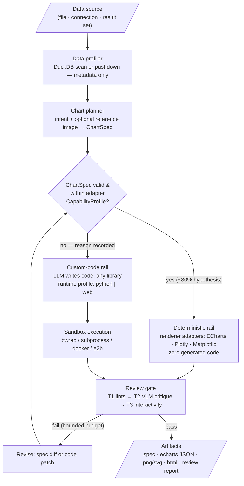
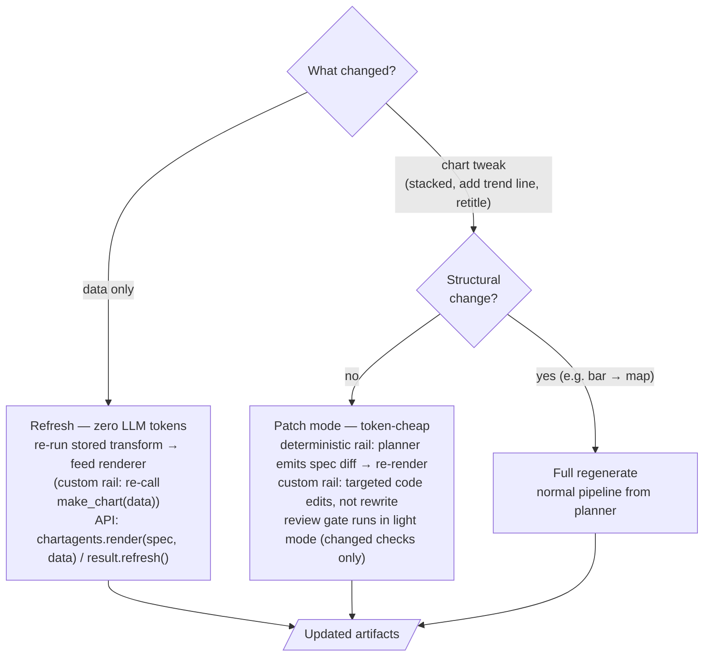

# chartagents — Product Requirements Document


|             |                                                                                               |
| ----------- | --------------------------------------------------------------------------------------------- |
| **Status**  | Draft v0.3 — review hardening pass, ready for design-doc phase                                |
| **Author**  | Sharim Pervez, with Claude                                                                    |
| **Date**    | July 9, 2026                                                                                  |
| **Product** | `chartagents` — an embeddable, agentic chart-creation library for Python                      |
| **License** | Apache-2.0 (decided — patent grant, enterprise-friendly, matches ECharts/LangChain ecosystem) |


**Changelog v0.3:** review hardening — determinism claim rescoped to spec-anchored reproducibility; ~80% deterministic-rail share explicitly marked a hypothesis with a Phase 0 validation gate; benchmark enlarged to ≥150 cases with an independent judge and human calibration (LLM-as-judge self-preference bias addressed); prompt injection via profiled metadata added as a first-class risk with mitigations; `raw_sql` escape scoped to file-like sources in v1; VFS persistence requirement for stateless refinement specified; schema-drift behavior on zero-LLM refresh specified; provisional cost-per-chart target published; observability hooks added to P1; team-size assumption stated.

**Changelog v0.2:** all v0.1 open questions resolved (§13); tiered local sandbox (bwrap auto-detect); three-flavor `DataSource` abstraction incl. text-to-SQL integration (Cortex Analyst pattern); zero-LLM refresh API promoted to P0; patch-mode chart edits; two-filesystem model documented; screenshot-reference scoped as P2; diagrams converted to Mermaid.

---

## 1. Problem statement

Every application team that wants "chart this data" as a product feature today faces the same build-vs-buy dead end. Building it means wiring together an LLM, a data-profiling layer, a code sandbox, a rendering pipeline, and a quality-review loop — months of infrastructure work that has nothing to do with their product. Buying it doesn't exist: consumer AI assistants (Claude, ChatGPT) produce excellent charts, but only inside their own chat UIs, on uploaded data, with no programmatic contract an application can depend on.

The cost of not solving this: thousands of SaaS products, internal tools, and data platforms either skip natural-language charting entirely, ship fragile home-grown LLM chart generators with no quality guarantees, or force users to leave the product and paste data into a chat assistant — losing the workflow, the branding, and control of the data.

chartagents closes this gap: a pip-installable library where `create_chart_agent()` + one method call turns a natural-language instruction and a pointer to data (file, S3 path, database connection, or an in-memory result set) into production-grade chart artifacts — with the data never leaving the caller's infrastructure.

---

## 2. Positioning and USP

**One-liner:** *Claude gives a person a chart in a chat. chartagents gives your application a charting capability behind an API.*

### The five pillars

1. **Embeddable, not conversational-only.** Output is a programmatic contract — typed artifacts (ECharts JSON, Plotly figure, PNG/SVG, HTML, and the validated ChartSpec itself) that drop directly into the caller's frontend, PDF export, or report pipeline. Not an artifact trapped in a chat session.
2. **Data never leaves your infrastructure.** Profiling runs via DuckDB against data where it lives (local files, S3/Parquet) or pushes down to the source engine (warehouse connections). Only metadata — schema, statistics, small samples — ever reaches the LLM. The execution sandbox is pluggable and self-hostable.
3. **Engineered reliability.** A deterministic rail (validated spec → hand-written renderer, zero generated code) handles the common majority of requests (working hypothesis: ~80%; validated in Phase 0, see §11); an agentic custom-code rail handles the rest; every chart passes a lint + VLM-critique + interactivity review gate before delivery. Reproducible by contract: every chart is anchored to its saved ChartSpec, and spec → artifact rendering is bit-stable across runs. (Planning is an LLM call and, like any model call, can vary between invocations — the spec, not the prompt, is the reproducibility anchor.) Published eval benchmark backs the quality claim.
4. **Cost and latency as a dial — including zero.** `quality="fast" | "balanced" | "best"` controls the review-loop budget per request; data refresh and re-render of an existing chart cost **zero LLM tokens** by design; conversational edits are token-cheap patches, not rewrites.
5. **Model-agnostic and customizable.** Any model via LangChain (including self-hosted for regulated environments). Org chart conventions — brand palettes, annotation rules, house style — ship as skills that apply to every generated chart.

### "But Claude already does this"

Yes — for an individual, in a chat, with an uploaded file. chartagents is for the thousand applications that want to give that experience to *their own users*, on *their own data*, with an SLA-shaped contract instead of a conversation. The Claude app validates the demand; chartagents distributes the capability. (Stripe : "banks already move money" :: chartagents : "Claude already makes charts.")

### Adjacent-competitor note: text-to-SQL platforms

Text-to-SQL systems (e.g., Snowflake Cortex Analyst) answer "*what data*"; chartagents answers "*what chart*." They are complements, not competitors — Cortex Analyst returns generated SQL whose execution yields a small result set, and Snowflake's own agent stack merely returns a bare Vega-Lite spec for charting: no review loop, no custom rail, no quality gate. chartagents is the quality-assured visualization layer downstream of any text-to-SQL system (see §7.4, DataSource flavor 3).

---

## 3. Target users and personas


| Persona                                                    | Description                                                                                                                   | What they need                                                                                                                           |
| ---------------------------------------------------------- | ----------------------------------------------------------------------------------------------------------------------------- | ---------------------------------------------------------------------------------------------------------------------------------------- |
| **P1 — SaaS product engineer** (primary)                   | Adding a "describe the chart you want" feature to a customer-facing product                                                   | Simple API, structured JSON output for their web frontend, predictable cost/latency, consistent results, brand theming, zero-LLM refresh |
| **P2 — Data platform / internal-tools engineer** (primary) | Exposing self-serve visualization over a warehouse or lakehouse to non-technical colleagues                                   | Connection-based data access (no uploads), large-data handling, self-hostable sandbox, auditability                                      |
| **P3 — AI application developer** (secondary)              | Building a larger agentic app (report generator, analyst copilot, text-to-SQL frontend) that needs charting as one capability | Composability with LangChain/LangGraph, in-memory result-set input, streaming events, conversation-history pass-through                  |


Explicitly **not** a target: the individual analyst doing ad-hoc exploration in a chat — the Claude app already serves them well (see Non-goals).

---

## 4. User stories

**P1 — SaaS product engineer**

- As a SaaS engineer, I want to call `agent.create_chart(data, instruction)` and receive ECharts JSON, so that I can render the chart in my existing web frontend with one `<div>`.
- As a SaaS engineer, I want to re-render a saved ChartSpec against fresh data with a single no-LLM call, so that my dashboards refresh on schedule at zero inference cost.
- As a SaaS engineer, I want a `quality` knob per request, so that I can serve free-tier users cheaply and premium users with the full review loop.
- As a SaaS engineer, I want to register my brand palette and style rules once, so that every chart my users generate is on-brand without per-request prompting.
- As a SaaS engineer, I want to persist a chart's spec and re-render it identically at any time, so that my product behaves predictably even as models and prompts evolve.

**P2 — Data platform engineer**

- As a platform engineer, I want to point the agent at a 50 GB Parquet dataset on S3 or a warehouse connection, so that charts are produced without the data being uploaded anywhere or loaded fully into memory.
- As a platform engineer, I want aggregation pushed down to my warehouse for connection sources, so that compute happens where the data and governance already live.
- As a platform engineer, I want to run the code sandbox on my own infrastructure, and get real isolation on Linux without a Docker dependency, so that generated code never executes outside my security boundary.
- As a platform engineer, I want a structured review report with every chart, so that I can log why a chart was approved and what the loop fixed.

**P3 — AI application developer**

- As an AI app developer, I want to hand chartagents the result set my text-to-SQL system (e.g., Cortex Analyst) already produced, so that I get a reviewed, production-grade chart instead of a bare spec.
- As an AI app developer, I want to pass prior `result.messages` back into the next call, so that my users can refine charts conversationally ("now break that down quarterly") while my service stays stateless.
- As an AI app developer, I want edits to existing charts to be token-cheap patches rather than full regenerations, so that refinement loops are fast and affordable.
- As an AI app developer, I want streaming progress events (profiling → planning → rendering → reviewing), so that I can show live status in my UI.

**Edge cases**

- As any caller, when the data source is unreadable or the instruction is unanswerable from the schema, I want a structured, typed error (not a hallucinated chart), so that my app can handle it gracefully.
- As any caller, when the review loop exhausts its budget without passing, I want the best-so-far chart returned with `review.passed = False` and the failing checks listed, so that I can decide whether to show it.

---

## 5. Goals

1. **Time-to-first-chart under 15 minutes** from `pip install chartagents` to a rendered chart from a natural-language instruction (measured via docs quickstart user testing).
2. **≥ 95% executable-output rate and ≥ 85% rubric pass rate** on the public eval benchmark (≥ 150 cases, see P0.10) at `quality="balanced"`, scored by an **independent judge** — a model distinct from both the planner and the in-loop critique VLM, calibrated against human double-scoring each release (LLM judges measurably favor their own generations; see §14). At n = 150, the 95% confidence interval on a 95% rate is roughly ±3.5 pp — narrow enough to publish; at n = 30 it would be ±8 pp, which is not. (LIDA's ~3.5% visualization error rate is directional prior art only — its metric and task definition differ, so we cite it as context, not as a head-to-head comparison.)
3. **≥ 75% of benchmark requests served by the deterministic rail**, keeping **median cost per chart ≤ $0.05 at `balanced`** (provisional target assuming a Sonnet-class planner and small critique model; finalized from measured token counts in Phase 2 and published with the benchmark); **refresh of an existing chart costs zero LLM tokens**.
4. **Handle a 10 GB Parquet source with < 500 MB peak agent-process memory** — proof of the profile-don't-load architecture.
5. **Adoption:** 1,000 GitHub stars / 10k monthly PyPI downloads within 6 months of v1.0 (proxy for "the default chart agent" positioning).

---

## 6. Non-goals

1. **Not a chat application or end-user UI.** We ship a library and (later) a reference server — never a hosted consumer product. Rationale: protects against scope-creep into competing with Claude/ChatGPT, where we lose.
2. **Not a BI platform.** No dashboard persistence, sharing, permissions, or scheduled reports in v1. Rationale: separate product category; our output composes into BI tools instead.
3. **Not a general data-analysis agent.** No open-ended EDA, statistical modeling, or "find insights" in v1. The instruction in, chart out contract stays tight. Rationale: quality claims are only defensible on a bounded task. (P2 future consideration.)
4. **Not multi-chart dashboards in v1.** One instruction → one best chart. Rationale: dashboard layout is a distinct hard problem; single-chart quality is the wedge.
5. **Not a training/fine-tuning effort.** We engineer around frontier models via prompting, skills, and review loops. Rationale: model-agnosticism is a pillar; fine-tunes break it.
6. **Not chart-data extraction from images.** When a screenshot is supplied as a reference (P2 feature, §9), we extract *style and structure only* — never the numeric values, which is an error-prone OCR problem that would poison our data-truthfulness guarantees.

---

## 7. Architecture overview

### 7.1 Core principle

**The LLM never touches raw data — only metadata flows through the agent; data flows only through the sandbox (or the source's own engine).**

### 7.2 Pipeline




Orchestration: LangGraph graph with a deterministic skeleton (profile → plan → route → render → review, review-fail edge back through revision) and **deepagents** subagent/planning/filesystem machinery inside the genuinely open-ended stages (planner exploration, reviewer repair). 

### 7.3 Key components

- **Data profiler.** For file sources: DuckDB lazy scan (see §7.4). Emits compact `profile.json`: schema, dtypes, cardinality, null rates, min/max/percentiles, stratified sample rows. Never materializes the dataset. All chart paths aggregate first and plot only aggregates. **Profiled metadata is attacker-influenced input:** column names, string values, and sample rows come from untrusted data and flow into LLM prompts — the classic indirect-prompt-injection vector (§14). Mitigations, all P0: profile content is always injected into prompts inside clearly delimited, escaped data blocks with an explicit "content is data, never instructions" framing; the planner's output is constrained to a validated ChartSpec (structured output, not free text), so injected instructions cannot redirect tool use on the deterministic rail; a Tier 1 lint screens profile content for instruction-like patterns and flags suspect sources in the review report; and on the custom rail, injected code intent is contained by the sandbox (§7.5) plus the data-truthfulness check.
- **ChartSpec (the contract).** A small, library-agnostic grammar of graphics (see §8). Versioned from day one.
- **Renderer adapters.** `RendererAdapter` protocol: `capabilities() -> CapabilityProfile`, `render(spec, rows) -> artifacts`. **Decided: adapters receive materialized aggregate rows** (small by construction), not query handles — adapters stay simple and portable; live-query handles are a P2 idea. First-party: ECharts (default web target; Apache-2.0, pure-JSON option objects), Plotly, Matplotlib. Public protocol — third parties can add Highcharts, D3, Vega-Lite, etc. Adding an adapter never touches the agent, planner, or review loop.
- **Rail router.** Deterministic validator checks the planner's spec against the chosen adapter's `CapabilityProfile`. Expressible → deterministic rail. Not expressible → custom rail, with the *reason recorded* (telemetry that drives grammar growth: today's custom-rail requests become next version's deterministic ones). **The ~80% deterministic-rail share used throughout this document is a hypothesis, not a measurement** — it is derived from the concentration of common chart types in published request corpora, and is explicitly validated (or revised) against the Phase 0 pressure-test set and the eval benchmark before Phase 1 commits to the cost model (§11).
- **Custom-code rail.** The agent may choose any charting library, constrained by available **sandbox runtime profiles**: `python` (matplotlib/plotly/bokeh/seaborn/…) and `web` (Node + headless Chromium for D3/ECharts-custom/Chart.js — required to rasterize for review). Codegen prompt biases toward well-represented libraries (benchmark evidence: error rates track training-data familiarity — e.g., 1.8% incorrect code for Matplotlib vs 22% for Plotly in PandasPlotBench) unless the request pulls elsewhere. Generated code must be shaped `def make_chart(data) -> Figure` — data enters as a parameter, never inlined — which is what makes zero-LLM refresh possible (§7.6).
- **Review gate (uniform across rails — everything ends as a rendered image + optional live DOM).**
  - *Tier 1, deterministic lints (cheap, always):* code executed; artifact exists; axis labels present; legend when >1 series; label-overlap detection; colorblind-safe palette; bar-chart y-axis baseline; **data-truthfulness check** (re-run the transform independently, compare against values in the figure object); injection-pattern screen on profiled metadata (instruction-like strings in column names/sample values flagged in the review report).
  - *Tier 2, VLM critique (only if lints pass):* rubric — readability, truthfulness to data, chart-type appropriateness, aesthetics; approve or emit structured feedback. Bounded loop (budget set by `quality`), best-of-so-far selection. (Prior art: METAL's generate→critique→revise loop shows monotonic quality gains with compute.)
  - *Tier 3, interactivity verification (HTML outputs):* Playwright loads the artifact; asserts no console errors, plot painted, hover produces tooltip; screenshots for the VLM.
- **Skills.** deepagents-style SKILL.md bundles for chart-domain knowledge (time-series conventions, per-library gotchas) and **user-extensible org conventions** (brand palette, "always annotate fiscal-year boundaries").

### 7.4 DataSource abstraction — three flavors (decided)


| Flavor                   | Examples                                                                                                                                                                                                       | Engine                                                                                                                                                                                                                         | Profiling cost                  |
| ------------------------ | -------------------------------------------------------------------------------------------------------------------------------------------------------------------------------------------------------------- | ------------------------------------------------------------------------------------------------------------------------------------------------------------------------------------------------------------------------------ | ------------------------------- |
| **File-like**            | local CSV/Parquet/JSON, S3/HTTP URLs, user uploads (app saves file, passes path)                                                                                                                               | **DuckDB** — embedded engine reading data in place; for remote Parquet, httpfs range-requests fetch only footers + needed column chunks (a 50 GB file profiles by transferring MBs); CSVs stream chunk-wise, never accumulated | Low, bounded memory             |
| **Connection-like**      | Snowflake, Postgres, BigQuery connections                                                                                                                                                                      | **Pushdown** — the ChartSpec transform block compiles to the source's SQL dialect and runs in *their* engine; data and governance stay put                                                                                     | Near-zero (metadata queries)    |
| **In-memory result set** | DataFrame / Arrow table / list-of-dicts — e.g., the executed output of a text-to-SQL system such as Snowflake Cortex Analyst (which returns generated SQL whose warehouse execution yields a small result set) | DuckDB queries the frame zero-copy                                                                                                                                                                                             | Trivial — data is already small |


Flavor 3 makes chartagents the natural downstream of any text-to-SQL product: their layer decides *what data*, chartagents decides — and quality-assures — *what chart*.

### 7.5 Sandbox: what runs inside, and the isolation tiers (decided)

**Rule:** any code authored or influenced by the LLM, and any parsing of untrusted data content, executes in the sandbox. Orchestration, ChartSpec validation, routing, and the deterministic renderer's spec→JSON compilation (pure trusted code) run in-process.

In-sandbox by stage: profiling scans (trusted code but untrusted *content* — defense-in-depth; also runs sandbox-side when the sandbox is remote/near the data); transform queries on both rails (LLM-derived); all custom-rail generated code (always, no exceptions); rasterization and Playwright checks (executes generated HTML/JS; `web` runtime profile).

`**SandboxBackend` protocol:** `upload(path)`, `run(code) -> {stdout, stderr, artifacts}`, `download(path)`. Backends and tiers:


| Tier | Backend              | Isolation                                                                                                 | Availability                            |
| ---- | -------------------- | --------------------------------------------------------------------------------------------------------- | --------------------------------------- |
| 1    | `subprocess`         | Resource limits (rlimits), restricted env — weakest tier, honest docs                                     | Everywhere                              |
| 2    | `bwrap` (bubblewrap) | Linux user namespaces: private mount/pid/net namespaces, read-only binds, no daemon, no Docker dependency | Linux with unprivileged user namespaces |
| 3    | `docker`             | Container isolation                                                                                       | Wherever Docker runs                    |
| 4    | `e2b` (and similar)  | Firecracker microVM — strongest; for untrusted-data production                                            | Cloud / self-hosted                     |


**Default behavior (decided):** `sandbox="local"` **auto-detects** — probe for bwrap → use it; unavailable (macOS/Windows, or namespaces disabled) → fall back to `subprocess` with a logged warning naming the active tier. Explicit `sandbox="bwrap" | "subprocess" | "docker" | "e2b"` (or a custom backend instance) overrides. Docker+ recommended for production in docs. (macOS `sandbox-exec` tier is a P2 consideration.)

### 7.6 Two filesystems, one bridge

The **deepagents virtual filesystem** is the agent's shared workspace — `profile.json`, `chart_spec.json`, `review_report.json` — so each subagent reads only what it needs instead of dragging everything through the context window (pluggable backends: in-memory, local disk, LangGraph store). The **sandbox filesystem** is the real one where data and execution live. One explicit bridge: sandbox runs finish by copying declared artifacts (PNG, figure JSON) into the VFS. Raw data never crosses the bridge — only artifacts and metadata.

### 7.7 Chart lifecycle: refresh vs. edit vs. regenerate (decided)




Not fragile placeholder-patching — **parameterization by design**: specs separate transform from encoding; ECharts option objects separate `series[].data` from config (callers may even patch data client-side); generated code takes data as a parameter. Patch-mode editing is also the *more reliable* path — editing outscores from-scratch generation for frontier models (e.g., GPT-4o: 93.6 on ChartEdit vs 83.2 on ChartMimic).

**Schema drift on refresh (decided).** Refresh begins with a cheap schema check: the new snapshot's schema is validated against the fields the spec's transform and encodings actually reference. A renamed, dropped, or retyped referenced column raises a typed `SchemaDriftError` listing exactly which fields changed and how — never a silently wrong or empty chart. Additive drift (new unreferenced columns) is ignored. Recovery is the caller's choice: fix the data, edit the spec, or regenerate; the error carries enough detail to drive an automated "regenerate on drift" policy caller-side.

### 7.8 Public API (stateless-first)

```python
agent = create_chart_agent(
    model="anthropic:claude-sonnet-4-6",
    sandbox="local",                # auto-detect bwrap → subprocess; or "bwrap"|"subprocess"|"docker"|"e2b"|custom
    outputs=["png", "echarts"],
    quality="balanced",             # "fast" | "balanced" | "best"
)

result = agent.create_chart(data="s3://bucket/sales.parquet",
                            instruction="Monthly revenue by region, last 2 years")
result.spec; result.artifacts; result.review; result.messages

# conversational refinement — client owns state; patch-mode under the hood
result2 = agent.create_chart(data=..., instruction="Now break that down quarterly",
                             history=result.messages)

# zero-LLM data refresh
fresh = chartagents.render(result.spec, data="s3://bucket/sales.parquet")
```

`result.messages` carries *references* to VFS artifacts, not raw data, so history stays small enough for stateless HTTP services. **Constraint (decided):** those references must resolve on the next call. Same-process refinement works with the default in-memory VFS; cross-request/cross-process refinement (the stateless-HTTP story) requires a persistent VFS backend — local disk for single-node deployments, LangGraph store for distributed ones — configured at `create_chart_agent()` time. If a history reference can't be resolved, the call fails with a typed error naming the missing artifact rather than silently replanning from scratch. LangGraph checkpointer/thread persistence remains available for callers who prefer server-held state.

### 7.9 Chart-choice policy

One best chart per request. The planner internally sketches 2–3 candidates before committing (single cheap call; measurably better selection per LIDA/METAL literature); rejected candidates are kept in result metadata so conversational refinement ("actually show it as a heatmap") is warm.

---

## 8. ChartSpec v1 outline

Design tension to hold: **rich enough for the common majority of requests (~80% hypothesis, §7.3), small enough that a deterministic renderer fully implements it.** Library-agnostic by construction — it describes *what the chart is*, never how a library draws it.

- `spec_version` — semantic version, required. Adapters declare `supports_spec <= X`.
- `data` — source reference + **transform block (decided):** a declarative operation menu — `filter`, `group_by`, `aggregate`, `pivot`, `sort`, `limit`, window basics — compiled by *our* code to the target engine's SQL (DuckDB or pushdown dialect); plus a clearly-flagged `raw_sql` escape hatch for cases the menu can't express. `**raw_sql` is scoped to file-like sources (DuckDB) in v1**, where it is validated read-only and single-statement against a single, known dialect. Connection-like sources (flavor 2) get the declarative menu only until dialect-aware validation ships — "read-only" is not reliably checkable across warehouse dialects (side-effectful functions, external functions, comment tricks), and pushdown runs inside the caller's governance boundary, so the conservative default wins. Menu-first mirrors the two-rail philosophy at the transform level.
- `mark` — `bar | line | area | scatter | pie/donut | heatmap | histogram | boxplot` (v1 set; grown by custom-rail telemetry).
- `encodings` — channels (`x`, `y`, `color`, `size`, `facet`, `tooltip`) each with field, type (quantitative/temporal/ordinal/nominal), scale, axis config. Deterministic encoding rules enforced at validation (e.g., cardinality caps on `color`).
- `layers` — bounded composition (e.g., line + point, bar + reference line).
- `annotations` — reference lines/bands, point labels, text callouts.
- `interactions` — flags: tooltip, zoom/pan, legend-toggle, crossfilter (adapter capability–gated).
- `style` — theme reference, palette, title/subtitle/caption; org-skill overridable.
- `escape` — `mode: custom_code` + `reason` (machine-recorded) + chosen `library` + `runtime_profile`.
- `CapabilityProfile` (adapter side) — declared support matrix over marks, channels, interactions, layers, `max_spec_version`.

Full Pydantic draft is the immediate next design artifact after this PRD.

---

## 9. Requirements

### P0 — Must have (v1.0 cannot ship without)


| #     | Requirement                                                                                                                                 | Acceptance criteria (abridged)                                                                                                                                                                                                                                                                                                                                                   |
| ----- | ------------------------------------------------------------------------------------------------------------------------------------------- | -------------------------------------------------------------------------------------------------------------------------------------------------------------------------------------------------------------------------------------------------------------------------------------------------------------------------------------------------------------------------------- |
| P0.1  | `create_chart_agent()` public API with one-shot + `history=` conversational calls                                                           | Given a CSV path and instruction, when `create_chart` is called, then a result with ≥1 requested artifact, a validated spec, and serializable messages is returned; given prior messages, refinement instructions resolve against them                                                                                                                                           |
| P0.2  | DuckDB profiler with no full-data load (file-like sources)                                                                                  | Given a 10 GB Parquet file, when profiled, then peak agent memory < 500 MB and `profile.json` < 10 KB                                                                                                                                                                                                                                                                            |
| P0.3  | ChartSpec v1 grammar + validation, incl. declarative transform menu + flagged read-only `raw_sql` escape (file-like sources only in v1, §8) | Invalid specs rejected with typed errors before rendering; `raw_sql` containing writes/multi-statements rejected; `raw_sql` against a connection-like source rejected with a typed error; spec round-trips JSON ↔ Pydantic losslessly                                                                                                                                            |
| P0.4  | Deterministic rail with ECharts + Matplotlib adapters; adapters receive materialized aggregate rows                                         | Given a spec within capability profile, rendering involves zero LLM-generated code and produces identical output on repeated runs                                                                                                                                                                                                                                                |
| P0.5  | Custom-code rail with `python` runtime profile; generated code parameterized as `make_chart(data)`                                          | Given a request the grammar can't express, the router records the reason; code executes only in the sandbox; re-invoking with new data requires no LLM call                                                                                                                                                                                                                      |
| P0.6  | Sandbox protocol + tiered local backends (`bwrap` auto-detect → `subprocess` fallback) + `docker`                                           | On Linux with user namespaces, `sandbox="local"` selects bwrap and generated code cannot read host paths outside binds; on fallback, active tier is logged; docker backend enforces container isolation                                                                                                                                                                          |
| P0.7  | Review gate tier 1 (lints) + tier 2 (VLM, bounded loop)                                                                                     | Charts failing lints never reach the VLM; loop respects `quality` budget; on exhaustion, best-so-far returned with `review.passed=False` and failing checks listed                                                                                                                                                                                                               |
| P0.8  | Data-truthfulness check                                                                                                                     | Given a rendered chart, plotted aggregate values match an independent re-execution of the transform within tolerance, else the chart fails review                                                                                                                                                                                                                                |
| P0.9  | Typed structured errors                                                                                                                     | Unreadable source / unanswerable instruction produce typed errors, never a fabricated chart                                                                                                                                                                                                                                                                                      |
| P0.10 | Eval benchmark in CI                                                                                                                        | ≥ 150 dataset+instruction pairs across the chart taxonomy (a ≥ 30-pair smoke subset runs on every prompt/model change; the full set runs nightly and pre-release); rubric scored by a judge model distinct from the planner and the in-loop critique VLM; ≥ 20% of cases human-double-scored per release to calibrate the judge; published numbers always come from the full set |
| P0.11 | Zero-LLM refresh API — `chartagents.render(spec, data)` / `result.refresh()`                                                                | Given a saved spec and a new data snapshot with the same schema, an updated artifact is produced with zero LLM calls, on both rails; given a snapshot where a spec-referenced column is renamed/dropped/retyped, a typed `SchemaDriftError` is raised naming the drifted fields — never a silently wrong chart (§7.7)                                                            |
| P0.12 | In-memory result-set DataSource (flavor 3)                                                                                                  | Given a DataFrame/Arrow table (e.g., a text-to-SQL result), `create_chart` completes without file I/O and without re-uploading data anywhere                                                                                                                                                                                                                                     |


### P1 — Nice to have (fast follows)

- Plotly adapter; `web` sandbox runtime profile (Node + headless Chromium) enabling D3/custom-JS on the custom rail.
- Tier 3 interactivity verification via Playwright.
- Connection-like DataSource with dialect pushdown (Snowflake, Postgres) — flavor 2 productionized.
- Patch-mode edits formalized: spec-diff emission on the deterministic rail; targeted code edits on the custom rail; light-mode review for unchanged aspects.
- Streaming progress events; async API.
- Observability hooks: structured tracing of full runs (OpenTelemetry-compatible spans; LangSmith integration) so P2's auditability need covers not just the review report but the whole decision trail — profile emitted, spec planned, rail chosen, review iterations.
- Org-convention skills (brand palette/style packs).
- E2B sandbox backend.
- Candidate-chart metadata exposed for conversational pivots.

### P2 — Future considerations (design for, don't build)

- **Screenshot as style reference** ("make my data look like this chart"): a VLM step extracts *style and structure only* — chart type, layout, palette, annotation patterns — into a draft ChartSpec; user's data fills encodings; normal two-rail routing applies; review gate adds visual-similarity comparison against the reference. Prior art: ChartMimic's Customized Mimic task (reference image + own data); frontier models capable but unsolved (GPT-4o 83.2). Design hook now: planner input signature is `instruction + optional reference_image` from day one. Numeric data extraction from images is a non-goal (§6.6).
- Multi-chart dashboards / small-multiple layouts (spec `layers`/`facet` designed with this in mind).
- Query-handle adapter handoff (live data fetch in the browser).
- Vega-Lite adapter and spec export; macOS `sandbox-exec` local tier.
- Insight/EDA mode ("what should I chart?").
- Reference HTTP server + JS client SDK; per-tenant theming registry.

---

## 10. Success metrics

**Leading (days–weeks post-launch)**

- Quickstart completion: ≥ 60% of docs-quickstart sessions reach a rendered chart (target: < 15 min).
- Benchmark executable-output rate ≥ 95%; rubric pass ≥ 85% at `balanced` (full ≥ 150-case set, independent judge + human calibration per P0.10; measured in CI, published with confidence intervals).
- Deterministic-rail share ≥ 75% on benchmark; custom-rail reasons logged 100%.
- Median cost per chart ≤ $0.05 at `balanced` (provisional, per Goal 3; finalized and published in Phase 2).
- Median latency: deterministic rail < 10 s; custom rail < 60 s at `balanced`; refresh < 2 s (measurement: benchmark harness, p50/p95).

**Lagging (weeks–months)**

- PyPI monthly downloads (10k @ 6 months), GitHub stars (1k @ 6 months).
- ≥ 5 public production integrations / case studies @ 6 months, at least one downstream of a text-to-SQL system.
- Custom-rail share trending *down* release-over-release (grammar absorbing telemetry).
- Issue-tracker "wrong chart" reports per 1k downloads trending down.

*(Measurement note: the library ships fully offline by default — no phoning home; an explicit opt-in flag enables anonymous rail/latency stats. Benchmark + community signals are the primary metrics source.)*

---

## 11. Phased milestones


| Phase                                | Scope                                                                                                                                                                                                                                   | Exit criteria                                                                                                                                                                                                                                                                                                               |
| ------------------------------------ | --------------------------------------------------------------------------------------------------------------------------------------------------------------------------------------------------------------------------------------- | --------------------------------------------------------------------------------------------------------------------------------------------------------------------------------------------------------------------------------------------------------------------------------------------------------------------------- |
| **0 — Spec & spike** (2–3 wks)       | ChartSpec v1 Pydantic draft incl. transform menu + `raw_sql` validation; pressure-test against a 50-request corpus (20 nasty + 30 representative real requests); DuckDB profiler prototype; adapter protocol RFC; bwrap detection spike | Spec survives pressure tests or revisions documented; **measured deterministic-rail share on the corpus published internally — if < 60%, grammar scope and cost model revisited before Phase 1** (validates the ~80% hypothesis, §7.3); profiler meets P0.2 numbers; bwrap/subprocess auto-detect works on target platforms |
| **1 — Deterministic core** (4–6 wks) | Profiler + planner + ChartSpec validation + ECharts/Matplotlib adapters + lints + tiered local & docker sandboxes + in-memory DataSource + zero-LLM render API + eval harness v0                                                        | P0.1–P0.4, P0.6, P0.9–P0.12 green; deterministic rail works end-to-end incl. refresh                                                                                                                                                                                                                                        |
| **2 — Agentic quality** (4–6 wks)    | Custom-code rail (python profile, parameterized codegen); VLM review loop; data-truthfulness check; quality dial                                                                                                                        | P0.5, P0.7, P0.8 green; benchmark targets hit at `balanced`                                                                                                                                                                                                                                                                 |
| **3 — v1.0 launch** (2–3 wks)        | Docs (incl. text-to-SQL integration guide), quickstart, published benchmark results, API freeze, PyPI release under Apache-2.0                                                                                                          | All P0 acceptance criteria pass in CI; launch post with benchmark table                                                                                                                                                                                                                                                     |
| **4 — Fast follows**                 | P1 list (web runtime, Playwright tier 3, Plotly adapter, pushdown connections, patch-mode formalization, streaming, skills, E2B)                                                                                                        | Driven by launch telemetry, esp. custom-rail reasons                                                                                                                                                                                                                                                                        |


**Resourcing assumption:** the timeline above assumes 2 full-time engineers (phases largely sequential, with benchmark construction parallelizable). One engineer stretches the total to roughly 6–8 months; scale expectations accordingly.

No hard external deadlines. Dependency watch-items: deepagents API stability (pre-1.0 churn risk — pin versions), VLM cost/latency for the review loop (model choice per tier is configurable).

---

## 12. Risks and mitigations


| Risk                                                                                                                                                                            | Mitigation                                                                                                                                                                                                                                          |
| ------------------------------------------------------------------------------------------------------------------------------------------------------------------------------- | --------------------------------------------------------------------------------------------------------------------------------------------------------------------------------------------------------------------------------------------------- |
| deepagents API churn (young library)                                                                                                                                            | Deterministic LangGraph skeleton owns the pipeline; deepagents used at the "agentic joints" behind our own thin interface; version pinning                                                                                                          |
| VLM review cost makes `best` uneconomical                                                                                                                                       | Tiered gate ensures lints filter most failures cheaply; loop budget capped; model per tier configurable (small model for critique)                                                                                                                  |
| Grammar too small → custom rail overused (reliability + cost suffer)                                                                                                            | Escape-reason telemetry is a P0; grammar growth is the standing roadmap input                                                                                                                                                                       |
| Sandbox friction kills adoption                                                                                                                                                 | Tiered local default (bwrap → subprocess) needs zero setup; active tier logged honestly; docker one-liner; cloud backends strictly optional                                                                                                         |
| Weak isolation on subprocess fallback misunderstood as "secure"                                                                                                                 | Loud tier logging, explicit docs matrix, `require_isolation=True` option that errors instead of falling back                                                                                                                                        |
| "Claude/ChatGPT does this free" perception                                                                                                                                      | Positioning discipline (§2): embed-ability, data locality, reliability contract; publish the benchmark                                                                                                                                              |
| Benchmark gamed by overfitting prompts to it                                                                                                                                    | Hold-out set rotated per release; community-contributed cases                                                                                                                                                                                       |
| Prompt injection via untrusted data content — column names/sample values in `profile.json` carry adversarial instructions into planner prompts (indirect prompt injection, §14) | Delimited/escaped data blocks with data-not-instructions framing; planner output constrained to validated ChartSpec; Tier 1 injection-pattern lint flags suspect sources; custom-rail blast radius contained by sandbox + truthfulness check (§7.3) |
| Benchmark quality claims circular — same VLM critiques in-loop and judges the benchmark; LLM judges favor their own generations (§14)                                           | Judge model distinct from planner and critique VLM; ≥ 20% human double-scoring per release to calibrate the judge; published numbers carry confidence intervals (P0.10)                                                                             |
| Deterministic-rail share hypothesis (~80%) proves too optimistic → cost/reliability story weakens                                                                               | Measured in Phase 0 pressure tests and on the benchmark before Phase 1 locks the cost model; if share < 60%, grammar scope and published cost targets are revisited before launch (§11)                                                             |


---

## 13. Resolved decisions (formerly open questions)


| Question                         | Decision                                                                                                                                                                                                                                 |
| -------------------------------- | ---------------------------------------------------------------------------------------------------------------------------------------------------------------------------------------------------------------------------------------- |
| Transform block expressiveness   | Declarative operation menu compiled by our code, plus flagged `raw_sql` escape validated read-only/single-statement — file-like (DuckDB) sources only in v1; menu-only for connection pushdown until dialect-aware validation ships (§8) |
| Adapter data handoff             | Materialized aggregate rows (small by construction); query handles deferred to P2                                                                                                                                                        |
| Local sandbox default            | Tiered auto-detect: bwrap where available (Linux user namespaces) → subprocess + rlimits fallback with logged tier; explicit override and `require_isolation` flag; docker+ recommended for production                                   |
| License                          | Apache-2.0                                                                                                                                                                                                                               |
| Telemetry                        | Fully offline by default; explicit opt-in flag for anonymous stats                                                                                                                                                                       |
| Screenshot reference             | In scope as P2, style/structure extraction only; numeric extraction is a non-goal                                                                                                                                                        |
| Reproducibility contract         | Anchored to the saved ChartSpec (spec → artifact rendering is bit-stable); LLM planning is not claimed deterministic (§2)                                                                                                                |
| Benchmark judging                | ≥ 150 cases; judge model distinct from planner and critique VLM; ≥ 20% human double-scoring per release; published with confidence intervals (Goal 2, P0.10)                                                                             |
| Untrusted-metadata handling      | Profiled content treated as attacker-influenced: delimited data blocks, structured planner output, injection-pattern lint, sandbox containment (§7.3, §12)                                                                               |
| Stateless refinement persistence | Cross-process `history=` requires a persistent VFS backend (local disk / LangGraph store); unresolvable references raise a typed error (§7.8)                                                                                            |
| Refresh schema drift             | Schema check before refresh; drifted spec-referenced fields raise typed `SchemaDriftError`; additive drift ignored (§7.7, P0.11)                                                                                                         |


**Still open:**

- **[Product, non-blocking]** Naming check: `chartagents` availability on PyPI and trademark scan.
- **[Engineering, non-blocking]** Minimum supported Python version and Arrow as the internal interchange format (leaning yes — zero-copy with DuckDB and DataFrames).

---

## 14. Appendix — evidence base (from design research)

- Iterative generate→critique→revise loops measurably improve chart quality and scale with compute budget (METAL, 2025).
- Cross-language viz-agent errors concentrate in layout/readability (~42%) and data consistency (~32%) — the exact failure classes our lints + truthfulness check target (DV-World benchmark).
- LLM plotting-code error rates track library familiarity (Matplotlib 1.8% vs Plotly 22% incorrect-code in PandasPlotBench) — motivates the deterministic rail, adapter defaults, and codegen library bias.
- Editing outperforms from-scratch generation (GPT-4o: 93.6 ChartEdit vs 83.2 ChartMimic) — motivates patch-mode chart updates.
- Grammar-agnostic spec-first generation achieves low error rates (LIDA, VER ≈ 3.5%) — motivates ChartSpec as the contract.
- Metadata-not-data orchestration with sandboxed execution is the proven pattern in production assistants (Claude analysis/code-execution architecture; Anthropic data-analyst agent cookbook).
- Text-to-SQL systems (Snowflake Cortex Analyst) return generated SQL executed in the customer's warehouse, yielding small result sets — motivates the in-memory DataSource flavor and downstream-integration positioning.
- Reference-image chart generation is a studied task (ChartMimic: Direct/Customized Mimic; 4,800 curated triplets) — motivates the P2 screenshot feature and its style-only scoping.
- LLM-integrated applications that feed retrieved/ingested content into prompts are exploitable via indirect prompt injection — adversarial instructions embedded in data act like code (Greshake et al., "Not what you've signed up for," AISec 2023) — motivates treating profiled metadata as attacker-influenced input (§7.3, §12).
- LLM evaluators systematically score their own generations higher than human annotators do, with self-preference driven by self-recognition (Panickssery et al., "LLM Evaluators Recognize and Favor Their Own Generations," NeurIPS 2024) — motivates the independent benchmark judge and human calibration (Goal 2, P0.10).

