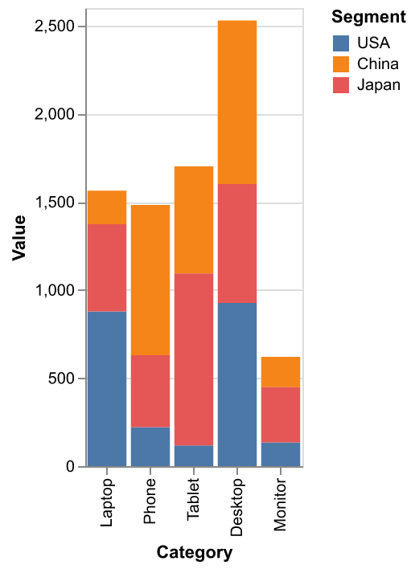
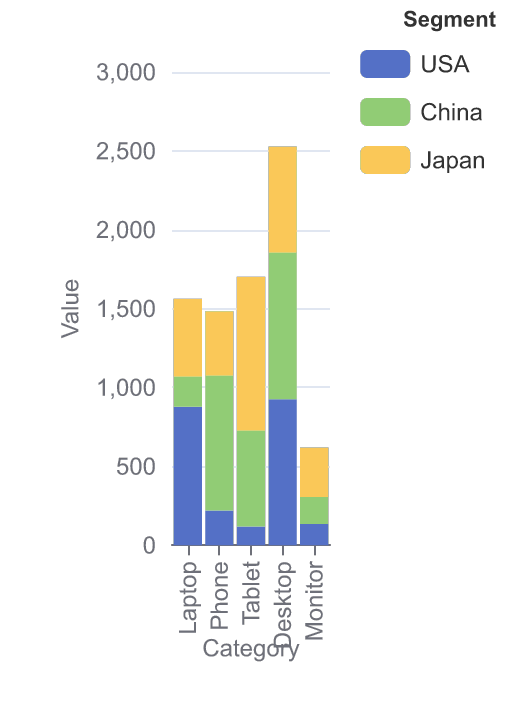

# Rasterising Flint backend output without Node in the compile path

- **Status:** Research notes for [issue #22](https://github.com/thearcscode/chartagent/issues/22). **Facts only — no decision.**
- **Date:** 2026-08-21
- **Decision this feeds:** issue #23, "Where rasterisation lives, and what it is allowed to serve"
- **Branch:** `research/rasterisation` (throwaway, branched from the `design` tip because the
  working tree had uncommitted design edits that blocked a checkout of `main`; the only files
  added are this one and `prototypes/rasterisation-probe/`)
- **Probes:** `prototypes/rasterisation-probe/` — every measured number below is reproducible
  from there. Measured on macOS 15 / arm64 (M-series), CPython 3.13.

## The tension being researched

ADR-0001 Decision 5 says the browser is the renderer and server-side rasterisation is "a
separate, later, queued service." PRD P0.7 makes the Tier-2 VLM critique a P0, and a VLM
critique structurally needs a rendered image. Something has to rasterise.

## Summary of what was established

1. **Vega-Lite has a real non-browser, non-Node rasteriser callable from Python: `vl-convert`.**
   All 705 of Flint's compiled Vega-Lite outputs rasterise to PNG with zero failures, p50 27 ms.
   BSD-3-Clause, self-contained wheels, no network needed for Flint's output.
2. **ECharts also has one, and it is better than expected.** ECharts' zero-dependency SSR SVG
   renderer runs inside the *same embedded JS engine ADR-0001 already puts in the process*.
   650 of 667 compilable fixtures render, p50 1.8 ms under PythonMonkey. The resulting SVG
   rasterises through resvg (which `vl-convert` already exposes).
3. **Chart.js and Plotly have no non-browser path.** Chart.js needs a native Canvas
   implementation; Plotly's Kaleido v1 is literally a headless Chrome. Excel is not a raster
   target at all.
4. **Fidelity against a browser is excellent for Vega-Lite and was measured, not assumed** —
   byte-identical SVG geometry against Chrome 151 on one chart. The residual risk is entirely
   about *font resolution on the deployment host*, which was not measured on Linux.
5. **The largest fidelity risk is not the rasteriser — it is backend mismatch.** ECharts is the
   default web target; rasterising Vega-Lite instead produces a visibly different chart.
6. **Tier-3 and rasterisation overlap in one direction only.** Playwright subsumes
   rasterisation; no non-browser rasteriser gives any Tier-3 signal.

---

## 1. Per-backend rasterisation paths that need neither a browser nor Node

### 1.1 Vega-Lite — `vl-convert` / `vl-convert-python`

[vega/vl-convert](https://github.com/vega/vl-convert) is a Rust crate exposed as a Python
extension via PyO3. Its own README states it plainly: *"`vl-convert-python` is fully
self-contained and has no dependency on an external web browser or Node.js runtime"*
([vl-convert-python README](https://github.com/vega/vl-convert/blob/main/vl-convert-python/README.md)).

**What it actually depends on.** It is not engine-free — it embeds **V8**, via
[`deno_runtime`](https://crates.io/crates/deno_runtime) / `deno_core`, and runs the real
Vega-Lite and Vega JavaScript libraries inside it. The minified JS for every supported
Vega-Lite version is inlined into the Rust binary, *"so no internet connection is required to
use vl-convert, and the executable and Python library are truly self-contained"*
([vl-convert README, "How it works"](https://github.com/vega/vl-convert#how-it-works)).
Rasterisation itself is [`resvg`](https://github.com/linebender/resvg); text measurement is
`usvg`; PDF is `svg2pdf`
([`Cargo.toml` at tag `v1.9.0`](https://github.com/vega/vl-convert/blob/v1.9.0/Cargo.toml):
`resvg = "0.45.1"`, `usvg = "0.45.1"`, `deno_core = "0.307.0"`, `svg2pdf = "0.13.0"`,
`fontdb` with the `fontconfig` feature).

So "no Node" is satisfied literally, but the honest statement is *no Node and no browser; yes,
a third JavaScript engine in the process*. See §5 on whether that co-exists with the compiler's
engine.

**Versions supported.** `vl_convert.get_vegalite_versions()` on the installed 1.9.0 wheel
returns `['5.8', '5.14', '5.15', '5.16', '5.17', '5.20', '5.21', '6.1', '6.4']`, with Vega
6.2.0 ([`import_map.rs`](https://github.com/vega/vl-convert/blob/main/vl-convert-rs/src/module_loader/import_map.rs)).
Flint 0.5.1 declares `vega-lite: "^5.0.0 || ^6.0.0"` and `vega: "^5.0.0 || ^6.0.0"` as optional
peer dependencies (`prototypes/flint-embed/build/npm/package/package.json`), so the supported
range covers what Flint targets. Flint emits **no `$schema` key** in any of the 705 fixtures, so
the Vega-Lite version used to render is ours to pin, not the spec's.

**Output formats.** SVG, PNG, JPEG, PDF, HTML, Vega spec, and Vega scenegraph — plus a
standalone `svg_to_png` / `svg_to_jpeg` / `svg_to_pdf`, which matters for §1.2.

**Measured against Flint's actual output** (`vlconvert_probe.py corpus`, all 705 fixtures from
`prototypes/flint-embed/build/specs_node.json`):

```
vl-convert 1.9.0, vega 6.2.0, vl_version=6.4
ok=705  fail=0  of 705      wall=28.5 s
per-chart: p50=27 ms  p90=79 ms  max=454 ms   median png=66 KiB
```

Cost of the engine (`vlconvert_probe.py cost`):

```
first conversion (V8 boot + Vega-Lite module load): 231 ms
warm mean over 20:                                   22 ms
RSS: before=122 MB  after-first=185 MB  after-21=220 MB
```

So roughly **+60–100 MB resident** and a **~230 ms one-off warm-up**, then ~22–27 ms per chart.
For scale, ADR-0001 measured the compiler itself at 0.12 ms per Vega-Lite compile under
PythonMonkey — rasterisation is ~200× the cost of compiling, and is the dominant term.

**Network.** Flint inlines rows: 700 of 705 fixtures carry `data.values`, 2 carry a `data.url`
(the two choropleths, pointing at `vega.github.io`), 3 carry neither. For the inline-data
majority, nothing is fetched.

**Hazard worth carrying forward:** when a `data.url` is unreachable, vl-convert **renders a
blank chart and does not raise**. The `choropleth__00__us_states` fixture produces a 129 KB SVG
with 58 `<path>` elements when the network is available and a 3 KB SVG with 7 `<path>` elements
when it is not — a successful call returning an empty chart. A review gate that treats "no
exception" as "rendered" would hand the VLM an empty canvas. (Note the README also documents
that Vega Editor-style relative dataset paths like `data/cars.json` are unsupported and need
absolute URLs.)

**Distribution.** Wheels are `cp37-abi3` for macOS x86_64/arm64, `manylinux_2_17`
x86_64/aarch64, and `win_amd64`, ~30–33 MB each; `requires_python >=3.7`; **no declared Python
dependencies at all** (PyPI JSON API for `vl-convert-python` 1.9.0.post1). There is **no musl
wheel**, so Alpine base images would build from source.

**Documentation drift, flagged:** the README on `main` documents `vlc.configure()`,
`warm_up_workers()`, `register_google_fonts_font()`, `auto_google_fonts`, and a
`vl_convert.asyncio` namespace. **None of these exist in the released 1.9.0 wheel** — `dir(vl_convert)`
has neither `configure` nor `warm_up_workers`. `main` is version `2.0.0-rc1`. Any plan relying on
the worker pool or automatic Google Fonts is relying on an unreleased version.

**The dead alternative:** `altair_saver` is the historical answer and is not one — last release
0.5.0 on 2020-03-31, and it depends on `selenium` (i.e. a browser) plus a Node toolchain.

### 1.2 ECharts — SSR inside the engine we already embed

Apache ECharts 5.3.0 introduced *"a new zero-dependency server-side string based SVG rendering
solution"*: `echarts.init(null, null, { renderer: 'svg', ssr: true, width, height })` then
`chart.renderToSVGString()`
([ECharts handbook — Server-Side Rendering](https://echarts.apache.org/handbook/en/how-to/cross-platform/server/)).
The zrender PR that implemented it is explicit that the point was to *"get rid of JSDom or
node-canvas in the NodeJS environment"* ([ecomfe/zrender#836](https://github.com/ecomfe/zrender/pull/836)).

The handbook frames this as a Node feature. **It is not — it is a runtime-neutral feature**, and
that turns out to matter a great deal here, because it means ECharts can rasterise inside the
*same* embedded engine ADR-0001 already puts in the CPython process.

Measured (`dump_echarts.py` then `echarts_ssr_probe.py`, ECharts 5.6.0 `dist/echarts.js` loaded
into the ADR-0001 engines, rendering the 667 ECharts option objects Flint 0.5.1 produces —
the same 667/38 split ADR-0002 records):

```
quickjs:      echarts 5.6.0 loaded in 123 ms   ok=650 fail=17 of 667
              per-chart SVG: p50=12.0 ms  p90=46.8 ms  max=370 ms
pythonmonkey: echarts 5.6.0 loaded in 206 ms   ok=650 fail=17 of 667
              per-chart SVG: p50=1.8 ms   p90=6.1 ms   max=43 ms
```

The SVG is **byte-identical between the two engines**, which is the same property ADR-0001's
fixture suite already relies on.

**Shims required.** Two, both trivial and both consistent with ADR-0001's finding that
`structuredClone` was the only missing global for the compiler:

- `structuredClone` (QuickJS only, already known).
- **Timers.** zrender calls `setTimeout` even with `ssr: true`. QuickJS has none.
  PythonMonkey *does* ship `setTimeout`, but it defers to a running Python asyncio loop and
  raises `RuntimeError: PythonMonkey cannot find a running Python event-loop` without one — so
  it has to be overridden, not merely polyfilled. A stub that never fires is sufficient; the SSR
  render path is synchronous.
- A `console` stub for QuickJS (PythonMonkey has a real one).

**SVG → PNG.** `vl_convert.svg_to_png` (i.e. resvg, already in the process if Vega-Lite
rasterisation is present) converts the ECharts SSR SVG: 40/40 sampled fixtures, median 55 KiB.
The result is **byte-stable**: 30/30 fixtures produce an identical PNG on repeat render, and
**identical with and without the entrance animation** — resvg ignores CSS animation
([resvg README: "No animations. There are no plans on implementing them either."](https://github.com/linebender/resvg#limitations)),
and the pre-animation state is not a hidden state, so nothing is lost. Setting
`animation: false` on the option, which the handbook documents, removes the CSS from the SVG
entirely and is the safer default.

The *SVG* string, by contrast, is **not** byte-stable — zrender emits per-instance class names
(`zr80-cls-1241`, `zr667-cls-38361`). Only the rasterised PNG is reproducible.

**Two findings that belong on the record regardless of the rasterisation decision:**

- **17 of 667 ECharts options fail to render with `Error: series.render is required`.** These
  are the boxplot fixtures. Flint emits a `series[]` entry with `"type": "custom"` and
  `"_companion": true` but **no `renderItem` function**, which ECharts requires for custom
  series. This is a property of Flint's output, not of SSR or of the engine — but **I did not
  verify it in a browser**, so "this also fails in the browser" is an inference, not a
  measurement. It sharpens ADR-0002's "a throw is not a difference" note into a third category:
  compiles, but does not render.
- **50 ECharts runtime warnings** (`"series not exists. Legend data should be same with series
  name or data name."`) surface on stderr during the PythonMonkey run. These are emitted at
  *render* time and are invisible to a compile-only pipeline.

### 1.3 Chart.js — no non-browser path

Chart.js paints to a canvas and the official docs offer exactly one server-side route: *"You can
use Chart.js in Node.js for server-side generation of plots with help from an NPM package such
as node-canvas or skia-canvas"*
([Chart.js — Using from Node.js](https://www.chartjs.org/docs/latest/getting-started/using-from-node-js)).
Both are native Node addons (node-canvas binds Cairo). There is no SVG renderer and no
string-output mode.

In principle one could implement a Canvas2D surface callable from PythonMonkey and drive
Chart.js through it. **I did not attempt this and have no evidence it is tractable** — it means
implementing paths, gradients, clipping, compositing and `measureText` against a real 2D
backend, which is a project, not a shim. Treat "Chart.js has no non-browser path" as true for
any realistic horizon.

Note also that ADR-0001 already records `theme_spec` being silently ignored by Chart.js, and
ADR-0002 records 110 of 705 fixtures unsupported by it, so Chart.js is the weakest raster target
on three independent counts.

### 1.4 Plotly — a well-known Python story that turns out to be a browser

Plotly's `fig.write_image()` is the ecosystem's standard answer, and since Plotly.py 6.1.1 it
runs on **Kaleido v1**. The Plotly docs are unambiguous: *"Kaleido uses Chrome for static image
generation. Versions of Kaleido prior to v1 included Chrome as part of the Kaleido package.
Kaleido v1 does not include Chrome; instead, it looks for a compatible version of Chrome (or
Chromium) already installed on the machine"*
([Static image export in Python](https://plotly.com/python/static-image-export/)). Kaleido's own
README says the same and ships a `kaleido_get_chrome` command
([Kaleido README](https://github.com/plotly/Kaleido/blob/master/src/py/README.md)). Its declared
dependencies are `choreographer` (a CDP driver), `logistro`, `orjson`, `packaging` — i.e. it is
a Chrome automation library, not a renderer.

Two consequences:

- Plotly rasterisation **is** browser-based rasterisation. It belongs in §2, not §1.
- It **defaults to fetching from a CDN**: the docs state `mathjax` *"Defaults to a CDN
  location. If fully offline export is required, set this to a local MathJax bundle"* and
  `topojson` likewise. Kaleido's `PageGenerator(force_cdn=True)` is *"the default behavior if
  plotly is not installed."* Offline operation is achievable but is configuration, not default.

Kaleido v0, which bundled its own Chromium, is superseded; Orca support ends after September 2025
per the same docs page.

### 1.5 Excel — not a raster target

Flint's Excel backend emits a workbook description, not a drawing. ADR-0002 records 340 of 705
fixtures unsupported by it. There is no rasterisation question here; there is a "should the
review gate skip this backend entirely" question, which belongs to #23.

### 1.6 Summary table

| Backend | Non-browser, non-Node raster path | Evidence |
| --- | --- | --- |
| Vega-Lite | **Yes** — `vl-convert` (V8-in-Rust + resvg) | 705/705, p50 27 ms, measured |
| ECharts | **Yes** — ECharts SSR in the embedded engine → resvg | 650/667, p50 1.8 ms (PythonMonkey), measured |
| Chart.js | **No** — needs node-canvas or skia-canvas | official docs |
| Plotly | **No** — Kaleido v1 drives real Chrome | official docs |
| Excel | n/a — not a raster target | — |

---

## 2. Browser-based options and their realistic footprint

**Measured.** `mcr.microsoft.com/playwright/python:v1.61.0-noble`, linux/amd64: **0.98 GB
compressed across 4 layers** (largest single layer 807 MB), read from the Microsoft Artifact
Registry manifest API. For contrast, `python:3.12-slim` linux/amd64 is **43 MB compressed**.
So the browser is roughly a **23× base-image multiplier**.

**Not measured, stated as a gap.** I could not obtain the *uncompressed* on-disk size (registry
manifests carry compressed layer sizes only), and the Chromium CDN
(`cdn.playwright.dev`) returns neither `Content-Length` on HEAD nor `Content-Range` on a ranged
GET, so the standalone `chrome-headless-shell` download size is unverified. Uncompressed will be
materially larger than 0.98 GB; treat any specific figure as unestablished.

**Operational constraints, from the [Playwright Docker docs](https://playwright.dev/python/docs/docker):**

- *"Using `--ipc=host` is recommended when using Chromium. Without it, Chromium can run out of
  memory and crash."*
- *"Browser builds for Firefox and WebKit are built for the glibc library. Alpine Linux and
  other distributions that are based on the musl standard library are not supported."*
- *"This Docker image is intended to be used for testing and development purposes only. It is
  not recommended to use this Docker image to visit untrusted websites."* — worth weighing
  against PRD §7.4, which routes custom-rail generated HTML/JS through the `web` runtime
  profile. Generated code is untrusted code.
- Root runs with the Chromium sandbox disabled; a non-root user plus a seccomp profile allowing
  `clone`/`setns`/`unshare` is the documented alternative.

**CI job vs hosted request path.** These constraints read very differently in the two settings,
and the difference is what #23 has to price:

- *CI job:* a ~1 GB image is a cache-warm pull; cold start is amortised over a whole suite;
  `--ipc=host` and `--cap-add=SYS_ADMIN` are available; the code under test is our own. Almost
  none of the objections bite.
- *Hosted request path:* the image size becomes per-instance cold-start and per-instance disk;
  a browser process per concurrent render is hundreds of MB of RSS on top of the ~60–100 MB
  vl-convert already costs; `--ipc=host` weakens container isolation in a multi-tenant setting,
  which collides with ADR-0001's note that PythonMonkey's single global realm already forces
  tenant isolation onto process/container boundaries.

**I did not measure browser cold start or per-page memory.** Those numbers are absent from this
document deliberately rather than guessed.

---

## 3. Fidelity — does the rasterised image match what the browser shows?

This is the question that decides whether a VLM critique is worth anything, so it was measured
rather than reasoned about.

### 3.1 Vega-Lite via vl-convert vs Chrome: identical geometry

**Method.** Take one Flint fixture (`bar_chart__04__n_5_q_color_n_3_15_pts` — five categories,
three-series stacked bars, legend, rotated axis labels). Produce (a) `vl_convert.vegalite_to_svg`
and (b) a self-contained vega-embed HTML page via `vl_convert.vegalite_to_html(bundle=True)`
rendered in **Chrome 151** over `http://localhost`, then serialise the live DOM's `<svg>` and
diff the two strings inside the page.

**Result.** After normalising three purely cosmetic attribute differences — vl-convert emits
`<rect fill="white"/>` where the browser puts `style="background-color: white"` on the root, and
the browser adds `fill="transparent"` to the frame path — the two SVG strings are **exactly
equal**, 11,882 characters each.

Layout-determining coordinates match to the last binary digit:

| element | vl-convert SVG | Chrome DOM |
| --- | --- | --- |
| y-axis title | `translate(-36.0244140625,142.5) rotate(-90)` | `translate(-36.0244140625,142.5) rotate(-90)` |
| x-axis title | `translate(67.5,56.6845703125)` | `translate(67.5,56.6845703125)` |
| root size | `258 × 354` | `258 × 354` |

This is the interesting result, because vl-convert deliberately *replaces* Vega's text-measurement
function with a Rust one built on `usvg` — the README explains that node-canvas is unavailable
in Deno, that Vega otherwise *"falls back to a rough heuristic for text measurement that results
in poor text placement"*, and that the `usvg` override is how accurate placement is regained
([vl-convert README](https://github.com/vega/vl-convert#vega-lite-to-svg)). The measurement
above says that override doesn't merely approximate Chrome — on this machine it reproduces it
exactly.

**The essential caveat, and it is a large one.** Both sides resolved the same font. Flint's
compiled output contains **zero font references** — `"font"` and `fontFamily` appear 0 times
across all 705 specs — so every text node inherits the generic `font-family="sans-serif"`, which
each renderer resolves from its own font stack:

- Chrome resolves `sans-serif` from the OS. On this macOS host that is Helvetica.
- resvg *"doesn't rely on any system libraries, which implies that we cannot use native text
  rendering"* and resolves fonts through `fontdb` (built here with the `fontconfig` feature)
  ([resvg README](https://github.com/linebender/resvg#limitations)).

The exact match therefore demonstrates that **the layout algorithms agree when the font metrics
agree**. It does *not* demonstrate that they agree on a Linux container where resvg finds
DejaVu Sans (or nothing) while the end user's browser shows Segoe UI or Helvetica. vl-convert's
README warns about precisely this: *"SVG text placement and PNG text rendering require that the
fonts referenced by the exported chart are installed on the system that VlConvert is running
on… It will not have access to the user fonts that the web browser has access to."*

**I did not measure Linux font behaviour.** That is the single biggest unverified item in this
document, and it is cheap to close: run the same diff inside a Linux container with and without
a font package installed. Note also that pinning a font family in `theme_spec` and shipping that
font file with the service converts this from a divergence into a configuration, which is what
`register_font_directory` exists for.

One genuine structural difference regardless of fonts: **resvg supports the static SVG subset
only** — *"no `a`, `script`, `view` or `cursor` elements, no events and no animations."* Vega's
SVG output for a static chart uses none of these, which is why the diff came out clean. resvg
also advertises cross-platform pixel reproducibility (*"if you render an SVG file on x86 Windows
and then render it on ARM macOS — the produced image will be identical"*), which matches the
30/30 byte-identical PNG result in §1.2.

### 3.2 The bigger fidelity risk is backend mismatch, not rasteriser fidelity

ADR-0002 makes ECharts the default web target. ADR-0001 records that `theme_spec` is silently
ignored by ECharts. Put those together and rasterising *Vega-Lite* as a stand-in for a delivered
*ECharts* chart critiques a different picture. Same input document, same data, same 258×354
canvas:




Different palette, different series-to-colour assignment, different y-axis extent (2,500 vs
3,000), different legend placement, and the ECharts render collides its rotated tick labels with
the axis title while Vega-Lite does not. A Tier-1 label-overlap lint or a Tier-2 aesthetics
critique would reach opposite verdicts on these two images. **This is the fidelity problem that
actually bites, and it is internal to the project rather than a property of any rasteriser.**

### 3.3 What a static raster cannot tell a VLM

The ECharts handbook enumerates what SSR cannot support: *"Dynamically changing data; Clicking
on a legend to toggle whether the series is displayed or not; Moving the mouse to show a
tooltip; Other interaction-related features."* Flint sets `options.addTooltips` in 656 of 705
fixtures (93%, per ADR-0002), so tooltips are the norm in this corpus and are invisible in
every non-browser raster.

---

## 4. Licences

Nothing found is copyleft in a way that threatens an Apache-2.0 library, and nothing is
source-available or non-compete. The one licence to avoid is easy to avoid.

| Component | Licence | Source | Note |
| --- | --- | --- | --- |
| `vl-convert-python` / `vl-convert-rs` | **BSD-3-Clause** | PyPI metadata; [LICENSE](https://github.com/vega/vl-convert/blob/main/LICENSE) | permissive |
| `resvg` / `usvg` 0.45.1 | **Apache-2.0 OR MIT** | crates.io API | **relicensed at 0.45**; 0.44.0 and earlier were MPL-2.0 |
| `tiny-skia` | BSD-3-Clause | crates.io | resvg's rasteriser |
| `fontdb` | MIT | crates.io | |
| `deno_core` / `deno_runtime` | MIT | crates.io | embeds V8 (BSD-3-Clause, Google) |
| Vega 6.4.0 / Vega-Lite 6.4.3 / vega-embed 7.1.0 | BSD-3-Clause | npm registry | |
| Apache ECharts 5.6.0 | **Apache-2.0** | packed `package.json` | |
| zrender | BSD-3-Clause | npm registry | ECharts' renderer |
| `flint-chart` 0.5.1 | MIT (Microsoft) | packed `package.json` | for context |
| Chart.js 4.x | MIT | npm registry | |
| plotly.js 3.x | MIT | npm registry | |
| `kaleido` / `choreographer` | MIT (Plotly, Inc.) | PyPI metadata | but drives Chrome |
| `playwright` (Python) | Apache-2.0 | PyPI `license_expression` | browser binaries are separate |
| **`cairosvg`** | **LGPL-3.0-or-later** | PyPI metadata | **the one to avoid** — an obvious SVG→PNG choice, and copyleft |

Two things a lawyer would want flagged rather than asserted:

- **Browser binaries are not the automation library's licence.** Playwright the package is
  Apache-2.0; the Chromium/Chrome builds it downloads are separate artifacts under their own
  terms, and Playwright now ships "Chrome for Testing" builds (`cdn.playwright.dev/builds/cft/...`)
  rather than plain Chromium. Kaleido v1 likewise expects a Chrome the operator installs.
  **I did not review those terms** and they are the only licensing item here I would not call
  settled for a commercial hosted service.
- **resvg's relicense is version-sensitive.** vl-convert 1.9.0 pins resvg 0.45.1, which is
  Apache-2.0 OR MIT. An older vl-convert would pull MPL-2.0. Since the dependency is a
  separately-distributed wheel rather than vendored source, this is a "note it" rather than a
  "block on it" either way.
- `node-canvas`, the Chart.js route, is MIT but links Cairo (LGPL-2.1). Moot, since that route
  requires Node regardless.

---

## 5. The co-load question, and why my answer is weak

ADR-0001 records that QuickJS and PythonMonkey *"segfault if imported into the same
interpreter"*. vl-convert would put a **third** engine — V8 — in that process.

`coload_probe.py` runs each pairing in its own subprocess so a signal is observed rather than
suffered. Every pairing survived: `v8-only`, `quickjs-then-v8`, `v8-then-quickjs`,
`pythonmonkey-then-v8`, `v8-then-pythonmonkey`.

**Do not read that as clearance.** The probe is not demonstrably sensitive: a minimal
`import quickjs; import pythonmonkey` in one interpreter, which is the combination ADR-0001 says
crashes, **also survived here** (exit 0). So either the ADR's hazard needs a heavier workload or
a different ordering to reproduce, or it is platform-specific — and either way my passing
results are evidence about nothing much. What is actually needed before anyone puts vl-convert
in the same process as the compiler is a sustained, threaded, many-iteration run on the target
Linux platform. That was not done.

A cheap way to sidestep the question entirely: rasterisation in a separate process from
compilation. That is a design option for #23, not a finding.

---

## 6. Tier-3 overlap with rasterisation

**The overlap is one-directional, and that is the whole answer.**

PRD P1 Tier-3 wants Playwright to load the artifact and assert no console errors, plot painted,
hover produces a tooltip, plus *"screenshots for the VLM"* (PRD §7.3).

- **Playwright subsumes rasterisation.** `page.screenshot()` returns PNG bytes directly, with
  `full_page` and per-element variants ([Playwright screenshots](https://playwright.dev/python/docs/screenshots)).
  If Tier-3 infrastructure exists, Tier-2's image is one method call away and the marginal cost
  of rasterisation is approximately zero. The PRD already assumes this — §7.3 has Tier-3
  producing the screenshots.
- **No non-browser rasteriser gives any Tier-3 signal.** vl-convert produces an image and
  nothing else: no DOM, no console, no event loop, no hover. ECharts SSR is explicitly
  documented as unable to show a tooltip on hover. resvg discards `script` and events by design.
  Every one of Tier-3's three assertions is unreachable without a browser.

So the two are **not** independent workstreams, but they are also not the same one. The real
shape:

- Choosing a non-browser rasteriser for Tier-2 does **not** reduce Tier-3's cost at all — Tier-3
  still needs the entire browser stack.
- Choosing Playwright for Tier-2 **does** eliminate Tier-3's marginal infrastructure cost.
- The decision is therefore not "which rasteriser" in isolation but "do we pay for a browser
  once, at P2, or never" — and if Tier-3 is genuinely wanted at P1, a second rasteriser may be
  redundant infrastructure rather than a saving.
- One asymmetry that cuts the other way: a non-browser rasteriser is *deterministic and
  byte-stable* (30/30 identical PNGs, §1.2; resvg's cross-platform pixel guarantee, §3.1). A
  browser screenshot is not, which matters for the PRD's "spec → artifact rendering is
  bit-stable across runs" claim and for any golden-image regression suite.

---

## 7. Open questions I could not settle

Listed plainly, because an honest gap is more useful than a confident guess.

1. **Linux font resolution.** The byte-identical result in §3.1 is one chart on one macOS host
   where both renderers found the same font file. Unmeasured on Linux, where the divergence would
   actually live. Highest-value cheap follow-up.
2. **Fidelity beyond one chart.** §3.1 diffs a single fixture. A 705-fixture browser-vs-vl-convert
   diff is entirely feasible with the existing probe and was not run.
3. **Browser cold start and per-render memory.** Not measured. Image size (0.98 GB compressed)
   is measured; nothing else about the browser's runtime cost is.
4. **Uncompressed Playwright image size** and standalone Chromium download size — the registry
   and CDN do not expose them by the routes I tried.
5. **Whether the 17 boxplot render failures also fail in a browser.** Inferred from ECharts'
   custom-series contract, not verified.
6. **Whether V8 co-loading with PythonMonkey is actually safe** — see §5; my probe is not
   sensitive enough to be evidence either way.
7. **Chrome for Testing / Chrome binary licence terms** for a commercial hosted service. Not
   reviewed.
8. **Plotly SSR without a browser.** I found no non-Chrome path and did not exhaustively search
   for one; plotly.js is a browser library and I would be surprised, but "no such thing exists"
   is not something I verified.
9. **ECharts SSR under sustained load in the embedded engine.** The probe renders 667 charts
   serially in one context. Memory growth, context reuse, and the ADR-0001 thread rules were not
   exercised.

---

## Reproducing

```
cd prototypes/rasterisation-probe
# vl-convert (needs a venv with vl-convert-python)
python vlconvert_probe.py corpus      # 705 fixtures -> PNG
python vlconvert_probe.py cost        # cold start, warm rate, RSS
python vlconvert_probe.py fonts       # what font ends up in the SVG
python vlconvert_probe.py offline     # data.url behaviour

# ECharts SSR (needs the ../flint-embed venv, plus echarts packed into build/npm)
python dump_echarts.py                # 705 fixtures -> 667 ECharts options
python echarts_ssr_probe.py quickjs
python echarts_ssr_probe.py pythonmonkey
python echarts_svg_to_png.py          # SSR SVG -> resvg PNG, stability checks

python coload_probe.py                # engine co-existence smoke test (see §5)
```

## Related

- ADR-0001 — Decision 5 (render client-side), the `theme_spec` gap on ECharts, the engine
  table, and the cross-thread QuickJS hazard.
- ADR-0002 — the 340/110/38 per-backend unsupported counts, `options.addTooltips` at 93%, and
  the ECharts-as-default-web-target framing.
- `chartagent-prd.md` §7.3 (review-gate tiers), P0.7 (Tier-2 VLM critique), §7.4 (rasterisation
  and Playwright run in the `web` sandbox profile).
